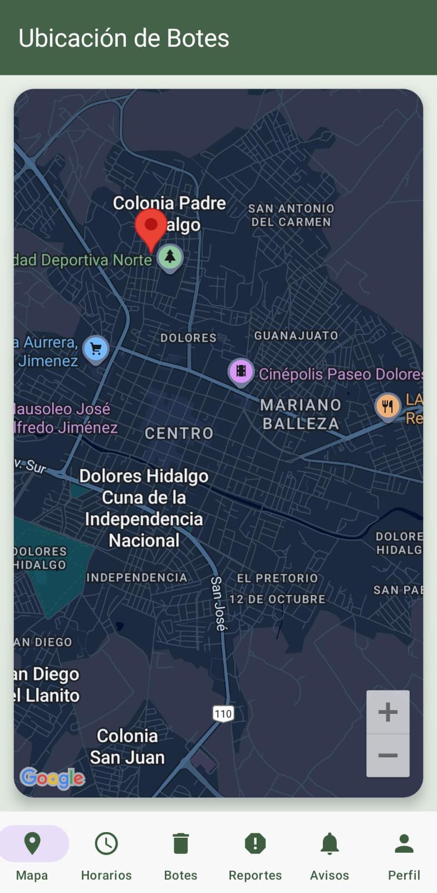
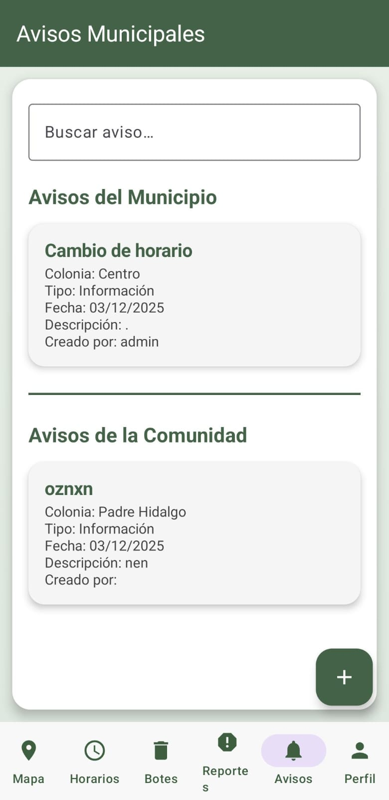
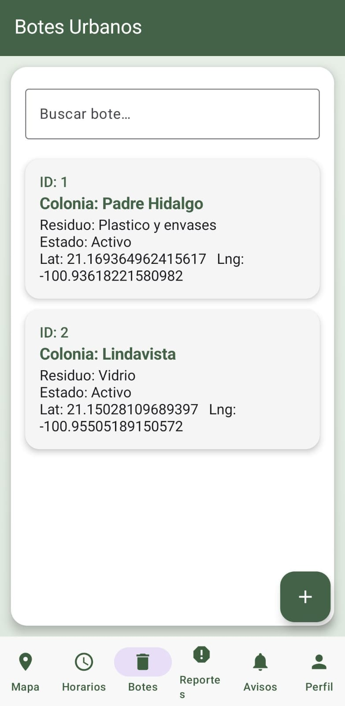
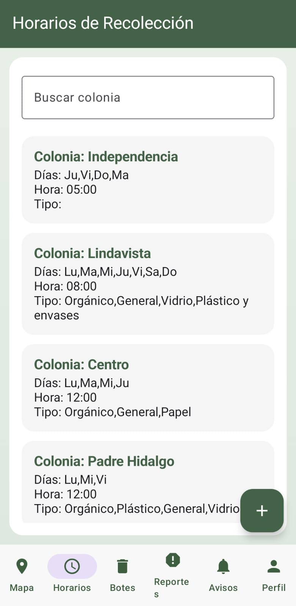
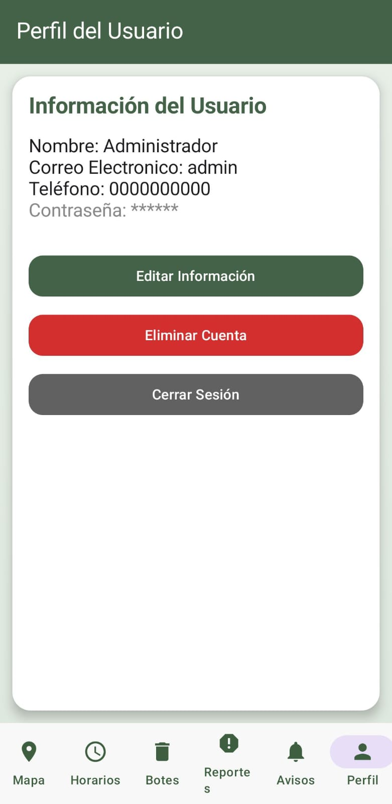

Gestor de Residuos Urbanos 

Gestor de Residuos Urbanos es una aplicación móvil diseñada para mejorar la forma en que los ciudadanos reportan, registran y visualizan problemas relacionados con los residuos urbanos en su comunidad. Su propósito es ofrecer un medio accesible y rápido para notificar incidentes como acumulación de basura, puntos críticos de contaminación o contenedores desbordados. A través de una interfaz intuitiva y funcionalidades modernas, la aplicación busca fomentar la participación ciudadana y facilitar la comunicación entre la población y los servicios municipales responsables del mantenimiento urbano.


La plataforma integra herramientas como geolocalización, registro fotográfico y almacenamiento en la nube para asegurar que cada reporte sea documentado de forma precisa y en tiempo real. Al centralizar esta información en un sistema digital, se habilita una mejor organización de los reportes y una mayor capacidad de análisis por parte de las autoridades, permitiendo identificar patrones, zonas con mayor demanda de atención y oportunidades para optimizar rutas de limpieza.


Además, el proyecto tiene un enfoque ambiental y social, promoviendo prácticas responsables en el manejo de residuos y generando conciencia sobre la importancia de mantener espacios libres de basura. Su diseño modular y escalable permite añadir futuras mejoras, como estadísticas avanzadas, notificaciones o integración con sistemas municipales. En conjunto, Gestor de Residuos Urbanos representa una herramienta tecnológica eficiente para apoyar la mejora continua del entorno urbano.


- Gestión de botes de residuos
  
Registro, edición y eliminación de botes.

Campos: colonia, tipo de residuo, estado del bote, latitud y longitud.

Uso de IDs consecutivos y búsqueda de botes por ID local.


- Gestión de horarios de recolección

Módulo para registrar horarios por colonia.

Selección de días de la semana (Lu, Ma, Mi, Ju, Vi, Sa, Do).

Selección de tipos de residuo (orgánico, inorgánico, vidrio, plástico, papel, etc.).

Elección de hora con TimePicker y control de “activo/inactivo” en Firestore.


- Módulo de reportes de incidentes
  
Registro de reportes asociados a un bote y a una colonia.

Campos como usuario, tipo, descripción, fecha y estado del reporte.

Pantalla con lista de reportes, pestañas por estado (por ejemplo “Abiertos”), búsqueda por texto y actualización de estado.


- Módulo de avisos informativos

Registro y edición de avisos con título, descripción, fecha, tipo (Información, Alerta, Recordatorio), colonia y “creadoPor”.

Carga de colonias desde la colección de horarios para que solo se usen colonias registradas.

Soporte para edición de avisos existentes y manejo de ID consecutivo (idInt).


- Mapa de botes en Google Maps
  
Pantalla de mapa que carga los botes desde Firestore y los muestra con georreferenciados.

Uso de Google Maps (LatLng, CameraPosition) para centrar la vista en la zona urbana y visualizar la distribución de botes.


- Gestión de usuarios y roles (admin/usuario)

Pantalla de registro de usuarios con nombre, teléfono, correo y contraseña usando Firebase Authentication.

Los datos del usuario se guardan en la colección usuarios de Firestore y se usan preferencias compartidas para la sesión.


Imágenes de Pantallas








Tecnologías Utilizadas

La aplicación Gestor de Residuos Urbanos fue desarrollada utilizando un conjunto de tecnologías modernas orientadas a la creación de aplicaciones móviles robustas, escalables y fáciles de mantener. En la capa de presentación se empleó Android Studio como entorno principal de desarrollo, junto con Kotlin como lenguaje base debido a su eficiencia, seguridad en tipos y compatibilidad plena con el ecosistema Android actual. La interfaz de usuario fue implementada mediante Jetpack Compose, el framework declarativo de Android que permite construir pantallas dinámicas, reactivas y con menos código, logrando así una experiencia visual más moderna y fluida para el usuario.

Para el almacenamiento y gestión de datos, la aplicación utiliza Firebase Firestore, una base de datos NoSQL en la nube que permite sincronización en tiempo real y consultas eficientes. Esta tecnología es fundamental para funciones como la actualización instantánea de reportes, avisos, botes y horarios, lo cual permite que la información se mantenga siempre actualizada entre todos los usuarios de la aplicación. Asimismo, la autenticación se gestiona mediante Firebase Authentication, lo que facilita el registro y el inicio de sesión seguro, diferenciando entre usuarios administradores y usuarios estándar.

En cuanto a la visualización geográfica, se integró Google Maps SDK for Android, que permite mostrar la ubicación de los botes en un mapa interactivo mediante marcadores. Esta tecnología brinda herramientas esenciales para manejar coordenadas, mover la cámara, personalizar iconos y ofrecer una visualización clara de la distribución de puntos de recolección de residuos.

Además, la aplicación hace uso de componentes clave de Android Jetpack, como ViewModel, LiveData/StateFlow, coroutines y navegación por pantallas, lo que asegura una arquitectura organizada, con separación de responsabilidades y capacidad para escalar a nuevas funcionalidades. Finalmente, para persistencia local y manejo de sesión, se implementaron SharedPreferences, permitiendo recordar datos del usuario, rol y ajustes internos sin necesidad de acceder constantemente a la base de datos. En conjunto, estas tecnologías garantizan que Gestor de Residuos Urbanos sea una aplicación moderna, estable, rápida, segura y preparada para crecer con nuevas funciones en futuras versiones.


#  Gestor de Residuos Urbanos - Manual Completo
## Android con Jetpack Compose + Firebase

> **Manual profesional para estudiantes de desarrollo móvil**
---

##  Arquitectura del Proyecto

```
GestordeResiduosUrbanos/
├─ app/
│  ├─ data/
│  │  ├─ Aviso.kt
│  │  ├─ Bote.kt
│  │  ├─ Reporte.kt
│  │  ├─ Usuario.kt
│  │  ├─ Horarios.kt
│  │  └─ Repositories/
│  └─ ui/
│     ├─ auth/
│     │  ├─ LoginActivity.kt
│     │  └─ RegistroActivity.kt
│     ├─ main/
│     │  ├─ MainActivity.kt
│     │  ├─ PantallaMapaActivity.kt
│     │  ├─ PantallaBotesActivity.kt
│     │  ├─ PantallaAvisoActivity.kt
│     │  └─ PantallaReportesActivity.kt
│     └─ registro/
│        ├─ PantallaRegistroBoteActivity.kt
│        ├─ PantallaRegistroAvisoActivity.kt
│        ├─ PantallaRegistroHorarioActivity.kt
│        └─ PantallaRegistroReporteActivity.kt
```

---

### build.gradle.kts (Module: app)

```kotlin
plugins {
    id("com.android.application")
    id("org.jetbrains.kotlin.android")
    id("com.google.gms.google-services")
}

android {
    namespace = "mx.edu.utng.pal.gestorderesiduosurbanos"
    compileSdk = 34

    defaultConfig {
        applicationId = "mx.edu.utng.pal.gestorderesiduosurbanos"
        minSdk = 26
        targetSdk = 34
        versionCode = 1
        versionName = "1.0"
    }

    buildFeatures {
        compose = true
    }

    composeOptions {
        kotlinCompilerExtensionVersion = "1.5.0"
    }
}

dependencies {
    // Compose
    val composeBom = platform("androidx.compose:compose-bom:2024.02.00")
    implementation(composeBom)
    implementation("androidx.compose.ui:ui")
    implementation("androidx.compose.material3:material3")
    implementation("androidx.compose.material:material-icons-extended")
    implementation("androidx.activity:activity-compose:1.8.2")
    
    // Firebase
    implementation(platform("com.google.firebase:firebase-bom:32.7.0"))
    implementation("com.google.firebase:firebase-firestore-ktx")
    implementation("com.google.firebase:firebase-auth-ktx")
    
    // Google Maps
    implementation("com.google.android.gms:play-services-maps:18.2.0")
    implementation("com.google.maps.android:maps-compose:4.3.0")
    
    // Coroutines
    implementation("org.jetbrains.kotlinx:kotlinx-coroutines-android:1.7.3")
}
```

Modelos de Datos
```kotlin
Aviso.kt
kotlinpackage mx.edu.utng.pal.gestorderesiduosurbanos.data

/**
 * Representa un aviso o reporte generado dentro del sistema de gestión
 * de residuos urbanos.
 *
 * Esta clase modela todos los atributos necesarios para identificar,
 * clasificar y describir un aviso, incluyendo metadatos como el tipo,
 * la ubicación general (colonia), la fecha de creación y el usuario
 * que generó el aviso.
 *
 * @property id Identificador único del aviso dentro del sistema.
 * @property titulo Título breve del aviso para su rápida identificación.
 * @property descripcion Descripción detallada del incidente, situación o reporte.
 * @property fecha Fecha en la que se registró el aviso, en formato String.
 * @property tipo Tipo de aviso (por ejemplo: "orgánico", "inorgánico", "denuncia", etc.).
 * @property colonia Nombre de la colonia o zona donde se registró el aviso.
 * @property creadoPor Identificador del usuario que creó el aviso.
 */
data class Aviso(
    val id: String = "",
    val titulo: String = "",
    val descripcion: String = "",
    val fecha: String = "",
    val tipo: String = "",
    val colonia: String = "",
    val creadoPor: String = ""
)
Bote.kt
kotlinpackage mx.edu.utng.pal.gestorderesiduosurbanos.data

/**
 * Representa un contenedor de residuos (bote) dentro del sistema de gestión
 * urbana. Este modelo permite almacenar información relevante sobre la ubicación,
 * tipo de residuos que admite y su estado actual.
 *
 * Este objeto es utilizado tanto para visualización en el mapa como para
 * operaciones de consulta e identificación en Firestore.
 *
 * @property id Identificador único del bote.
 *              Puede ser String o Long dependiendo de cómo se generó en la base de datos.
 * @property colonia Zona o área en la que se encuentra ubicado el bote.
 * @property tipoResiduo Tipo de residuo que recibe (por ejemplo: orgánico, inorgánico).
 * @property estado Estado actual del bote (por ejemplo: lleno, vacío, reportado).
 * @property lat Latitud del bote, utilizada para su localización en el mapa.
 * @property lng Longitud del bote, utilizada para su localización en el mapa.
 */
data class Bote(
    val id: Any? = "",
    val colonia: String = "",
    val tipoResiduo: String = "",
    val estado: String = "",
    val lat: Double = 0.0,
    val lng: Double = 0.0
)
Horarios.kt
kotlinpackage mx.edu.utng.pal.gestorderesiduosurbanos.data

/**
 * Representa la programación de recolección de residuos dentro de una colonia
 * o zona urbana. Esta clase define los días, horarios y tipo de residuo que se
 * recoge, además de permitir controlar si el horario está activo o no.
 *
 * Este modelo generalmente se utiliza para:
 * - Mostrar horarios en pantalla al usuario
 * - Filtrar los horarios según colonia o tipo de residuo
 * - Sincronizar la información con Firestore o bases de datos locales
 *
 * @property id Identificador único del horario. Puede ser utilizado para búsquedas o actualizaciones.
 * @property colonia Nombre de la colonia o zona donde aplica el horario.
 * @property dias Días en los que se realiza la recolección (por ejemplo: "Lunes, Miércoles, Viernes").
 * @property hora Horario exacto de recolección (por ejemplo: "08:00 AM - 10:00 AM").
 * @property tipoResiduo Tipo de residuo correspondiente al horario (orgánico, inorgánico, reciclaje, etc.).
 * @property activo Indica si el horario está disponible (1 = activo, 0 = inactivo).
 */
data class Horarios(
    val id: Long = 0,
    val colonia: String = "",
    val dias: String = "",
    val hora: String = "",
    val tipoResiduo: String = "",
    val activo: Int = 1
)
Reporte.kt
kotlinpackage mx.edu.utng.pal.gestorderesiduosurbanos.data

/**
 * Representa un reporte generado por un usuario dentro del sistema de gestión
 * de residuos urbanos. Cada reporte describe un incidente o situación relacionada
 * con un bote de basura, así como información contextual relevante.
 *
 * Este modelo es utilizado para:
 * - Registrar reportes enviados por los usuarios
 * - Mostrar información detallada en pantallas de consulta
 * - Sincronizar datos con Firebase Firestore
 * - Controlar estados del reporte (pendiente, revisado, resuelto, etc.)
 *
 * @property id Identificador único interno del reporte en la aplicación.
 * @property usuario Nombre o ID del usuario que generó el reporte.
 * @property bote Identificador del bote relacionado con el reporte.
 * @property colonia Nombre de la colonia donde ocurrió el incidente.
 * @property tipo Tipo de reporte (orgánico, inorgánico, desbordado, denuncia, etc.).
 * @property descripcion Descripción detallada del incidente ocurrido.
 * @property fecha Fecha en que se registró el reporte (formato String).
 * @property estado Estado actual del reporte (por ejemplo: "pendiente", "revisado").
 * @property firebaseId ID del documento en Firebase Firestore.
 */
data class Reporte(
    val id: String = "",
    val usuario: String = "",
    val bote: String = "",
    val colonia: String = "",
    val tipo: String = "",
    val descripcion: String = "",
    val fecha: String = "",
    val estado: String = "",
    val firebaseId: String = ""
)
Usuario.kt
kotlinpackage mx.edu.utng.pal.gestorderesiduosurbanos.data

/**
 * Representa un usuario dentro del sistema de gestión de residuos urbanos.
 * Esta clase contiene los datos esenciales necesarios para la autenticación,
 * identificación y asignación de permisos dentro de la aplicación.
 *
 * Los usuarios pueden tener diferentes roles según el tipo de acceso requerido,
 * por ejemplo: "usuario" o "administrador". El rol por defecto es "usuario".
 *
 * @property id Identificador único del usuario en la base de datos.
 * @property nombreCompleto Nombre completo del usuario.
 * @property nombreUsuario Alias o nombre de usuario utilizado para iniciar sesión.
 * @property numeroTelefono Número telefónico de contacto del usuario.
 * @property contrasena Contraseña del usuario. Se recomienda encriptar antes de almacenar.
 * @property rol Rol asignado al usuario dentro del sistema (usuario, admin, etc.).
 */
data class Usuario(
    var id: String = "",
    var nombreCompleto: String = "",
    var nombreUsuario: String = "",
    var numeroTelefono: String = "",
    var contrasena: String = "",
    var rol: String = "usuario"
)
```
Repositorios
```
AvisoRepository.kt
kotlinpackage mx.edu.utng.pal.gestorderesiduosurbanos.data

import com.google.firebase.firestore.*
import kotlinx.coroutines.channels.awaitClose
import kotlinx.coroutines.flow.Flow
import kotlinx.coroutines.flow.callbackFlow
import kotlinx.coroutines.tasks.await

/**
 * Repositorio encargado de gestionar las operaciones CRUD relacionadas
 * con la colección "avisos" almacenada en Firebase Firestore.
 *
 * Esta clase centraliza la interacción con la base de datos y expone métodos
 * suspendidos y flujos reactivos, permitiendo que la capa de presentación
 * observe los cambios en tiempo real y ejecute operaciones de lectura/escritura
 * de manera segura mediante corrutinas.
 *
 * Funciones principales:
 * - Obtener avisos en tiempo real mediante Flow.
 * - Insertar, actualizar y eliminar avisos.
 * - Consultar avisos individualmente o como lista completa.
 */
class AvisoRepository {

    /** Instancia principal de Firebase Firestore. */
    private val db = FirebaseFirestore.getInstance()

    /** Referencia a la colección "avisos" dentro de Firestore. */
    private val ref = db.collection("avisos")

    /**
     * Obtiene un flujo reactivo (Flow) que emite una lista actualizada de avisos
     * cada vez que ocurre un cambio en la colección de Firestore.
     *
     * Se implementa mediante callbackFlow para convertir el listener de Firestore
     * en un flujo seguro para corrutinas.
     *
     * @return Flow<List<Aviso>> Flujo con la lista de avisos actualizada en tiempo real.
     */
    fun getAvisosFlow(): Flow<List<Aviso>> = callbackFlow {
        val listener = ref.addSnapshotListener { snapshot, _ ->
            if (snapshot != null) {
                trySend(snapshot.toObjects(Aviso::class.java))
            }
        }
        awaitClose { listener.remove() }
    }

    /**
     * Inserta un nuevo aviso dentro de Firestore.
     * Se genera automáticamente un ID en Firestore, el cual se asigna al aviso.
     *
     * @param aviso Objeto Aviso a insertar en la base de datos.
     */
    suspend fun insert(aviso: Aviso) {
        val doc = ref.document()
        val nuevo = aviso.copy(id = doc.id)
        doc.set(nuevo).await()
    }

    /**
     * Actualiza un aviso existente en Firestore.
     * La operación reemplaza completamente el documento identificado por el ID del aviso.
     *
     * @param aviso Aviso con los datos actualizados.
     */
    suspend fun update(aviso: Aviso) {
        ref.document(aviso.id).set(aviso).await()
    }

    /**
     * Elimina un aviso de la base de datos en Firestore basado en su ID.
     *
     * @param aviso Objeto Aviso que se desea eliminar.
     */
    suspend fun delete(aviso: Aviso) {
        ref.document(aviso.id).delete().await()
    }

    /**
     * Obtiene un aviso individual a partir de su ID.
     *
     * @param id Identificador único del aviso.
     * @return Aviso si existe, o null si el documento no se encuentra.
     */
    suspend fun getById(id: String): Aviso? {
        return ref.document(id).get().await().toObject(Aviso::class.java)
    }

    /**
     * Obtiene una lista completa de avisos desde Firestore mediante una
     * consulta estática única.
     *
     * A diferencia de getAvisosFlow(), esta función no observa cambios en tiempo real.
     *
     * @return Lista de avisos almacenados en Firestore.
     */
    suspend fun getAvisosList(): List<Aviso> {
        return ref.get().await().toObjects(Aviso::class.java)
    }
}
BoteRepository.kt
kotlinpackage mx.edu.utng.pal.gestorderesiduosurbanos.data

import com.google.firebase.firestore.FirebaseFirestore
import kotlinx.coroutines.channels.awaitClose
import kotlinx.coroutines.flow.Flow
import kotlinx.coroutines.flow.callbackFlow
import kotlinx.coroutines.tasks.await

/**
 * Repositorio encargado de gestionar las operaciones de lectura y escritura
 * sobre la colección "botes" almacenada en Firebase Firestore.
 *
 * Este repositorio centraliza toda la lógica relacionada con:
 * - Escuchar cambios en tiempo real
 * - Insertar nuevos botes
 * - Actualizar registros existentes
 * - Eliminar botes por ID
 * - Obtener la lista completa de botes
 *
 * La clase utiliza corrutinas (suspend) y Flows para garantizar
 * operaciones asíncronas seguras y reactivas.
 */
class BoteRepository {

    /** Referencia directa a la colección "botes" en Firestore. */
    private val ref = FirebaseFirestore.getInstance().collection("botes")

    /**
     * Obtiene un flujo en tiempo real que emite la lista de botes cada vez
     * que ocurre un cambio dentro de la colección de Firestore.
     *
     * Se usa callbackFlow para convertir el listener en un Flow compatible
     * con corrutinas.
     *
     * @return Flow<List<Bote>> lista actualizada de botes.
     */
    fun obtenerBotesFlow(): Flow<List<Bote>> = callbackFlow {
        val listener = ref.addSnapshotListener { snap, _ ->
            if (snap != null) trySend(snap.toObjects(Bote::class.java))
        }
        awaitClose { listener.remove() }
    }

    /**
     * Inserta un nuevo bote en Firestore.
     *
     * Se genera un ID automáticamente y se asigna al campo `id` para garantizar
     * consistencia en la base de datos.
     *
     * @param bote objeto Bote a guardar.
     */
    suspend fun insertar(bote: Bote) {
        val doc = ref.document()
        doc.set(
            bote.copy(id = doc.id) // Se asegura que el ID sea siempre String
        ).await()
    }

    /**
     * Actualiza un bote existente.
     *
     * Firestore requiere que el documento sea identificado por un string,
     * por lo que se convierte el campo `id` para garantizar compatibilidad.
     *
     * @param bote objeto Bote con valores actualizados.
     */
    suspend fun actualizar(bote: Bote) {
        val docId = bote.id.toString()
        ref.document(docId).set(
            bote.copy(id = docId)
        ).await()
    }

    /**
     * Elimina un bote de Firestore a partir de su ID.
     *
     * @param id identificador del bote, puede ser Any? pero se transforma a String.
     */
    suspend fun eliminar(id: Any?) {
        val docId = id.toString()
        ref.document(docId).delete().await()
    }

    /**
     * Obtiene todos los botes registrados en Firestore en una sola consulta.
     * A diferencia de obtenerBotesFlow(), esta función no escucha cambios
     * en tiempo real.
     *
     * @return lista completa de objetos Bote.
     */
    suspend fun obtenerTodos(): List<Bote> =
        ref.get().await().toObjects(Bote::class.java)
}
HorariosRepository.kt
kotlinpackage mx.edu.utng.pal.gestorderesiduosurbanos.data

import com.google.firebase.firestore.FirebaseFirestore
import kotlinx.coroutines.tasks.await

/**
 * Repositorio encargado de manejar todas las operaciones CRUD relacionadas
 * con la colección "horarios" en Firebase Firestore.
 *
 * Este repositorio abstrae la lógica de acceso a datos y permite:
 * - Obtener únicamente horarios activos
 * - Insertar nuevos horarios
 * - Actualizar horarios existentes
 * - Realizar eliminaciones lógicas (desactivar un horario)
 *
 * Todas las funciones utilizan corrutinas para asegurar llamadas asíncronas
 * sin bloquear el hilo principal.
 */
class HorariosRepository {

    /** Referencia a la colección "horarios" en Firebase Firestore. */
    private val ref = FirebaseFirestore.getInstance().collection("horarios")

    /**
     * Obtiene una lista de horarios activos desde Firestore.
     *
     * Realiza una consulta filtrada donde `activo = 1`, de modo que solo se
     * devuelvan los horarios vigentes.
     *
     * @return Lista de objetos Horarios activos.
     */
    suspend fun obtenerTodos(): List<Horarios> =
        ref.whereEqualTo("activo", 1)
            .get()
            .await()
            .toObjects(Horarios::class.java)

    /**
     * Inserta un nuevo horario en la base de datos.
     *
     * Se genera un ID automático de Firestore, pero como el modelo utiliza
     * un ID tipo Long, se convierte usando el hash del ID generado.
     *
     * @param h Objeto Horarios a insertar.
     */
    suspend fun insertar(h: Horarios) {
        val doc = ref.document()

        // Convertimos el ID generado por Firestore a Long usando su hash
        val idLong = doc.id.hashCode().toLong()

        doc.set(
            h.copy(id = idLong)
        ).await()
    }

    /**
     * Actualiza un horario existente reemplazando todo su contenido.
     *
     * @param docId Identificador del documento en Firestore.
     * @param h Objeto Horarios con los valores actualizados.
     */
    suspend fun actualizar(docId: String, h: Horarios) {
        ref.document(docId).set(h).await()
    }

    /**
     * Desactiva un horario en lugar de eliminarlo físicamente.
     *
     * Esta operación es conocida como "eliminación lógica": el horario
     * permanece almacenado en Firestore, pero marcado como inactivo.
     *
     * @param docId Identificador del documento a desactivar.
     */
    suspend fun eliminar(docId: String) {
        ref.document(docId).update("activo", 0).await()
    }
}
ReporteRepository.kt
kotlinpackage mx.edu.utng.pal.gestorderesiduosurbanos.data

import com.google.firebase.firestore.FirebaseFirestore
import kotlinx.coroutines.tasks.await

/**
 * Repositorio encargado de manejar todas las operaciones de acceso a datos
 * relacionadas con los reportes almacenados en la colección "reportes" de
 * Firebase Firestore.
 *
 * Este repositorio permite:
 * - Obtener todos los reportes almacenados
 * - Insertar nuevos reportes generados por los usuarios
 * - Actualizar el estado de un reporte (pendiente, revisado, atendido, etc.)
 *
 * Todas las operaciones son suspendidas para garantizar un uso adecuado
 * con corrutinas sin bloquear el hilo principal.
 */
class ReporteRepository {

    /** Referencia a la colección "reportes" en Firebase Firestore. */
    private val ref = FirebaseFirestore.getInstance().collection("reportes")

    /**
     * Obtiene todos los reportes registrados en Firestore.
     *
     * Esta función realiza una consulta única sin escucha en tiempo real.
     *
     * @return Lista completa de objetos Reporte.
     */
    suspend fun obtenerTodos(): List<Reporte> =
        ref.get().await().toObjects(Reporte::class.java)

    /**
     * Inserta un nuevo reporte en la colección "reportes".
     *
     * Se genera un ID automático para el documento y se asigna al
     * campo `id` del reporte antes de guardarlo.
     *
     * @param reporte Objeto Reporte a insertar en la base de datos.
     */
    suspend fun insertar(reporte: Reporte) {
        val doc = ref.document()
        doc.set(
            reporte.copy(id = doc.id) // Se asegura que el reporte tenga su ID asignado
        ).await()
    }

    /**
     * Actualiza únicamente el estado de un reporte existente.
     *
     * Esta operación es común para moderación o seguimiento de los reportes
     * realizados por los usuarios.
     *
     * @param id Identificador del reporte dentro de Firestore.
     * @param estado Nuevo estado a asignar (por ejemplo: "pendiente", "revisado").
     */
    suspend fun actualizarEstado(id: String, estado: String) {
        ref.document(id).update("estado", estado).await()
    }
}
```
```
API y Red
ApiClient.kt
kotlinpackage mx.edu.utng.pal.gestorderesiduosurbanos.network

import retrofit2.Retrofit
import retrofit2.converter.gson.GsonConverterFactory

/**
 * Cliente centralizado para configuración de Retrofit.
 * 
 * Patrón Singleton: Se crea una única instancia compartida
 * por toda la aplicación para optimizar recursos.
 */
object ApiClient {

    /** URL base donde se encuentran los servicios REST. */
    private const val BASE_URL = "https://tu-api.com/"

    /**
     * Instancia global de Retrofit construida solo una vez.
     *
     * Utiliza `lazy` para inicializarse únicamente cuando se necesite,
     * optimizando recursos.
     */
    val retrofit: Retrofit by lazy {
        Retrofit.Builder()
            .baseUrl(BASE_URL)
            .addConverterFactory(GsonConverterFactory.create())
            .build()
    }

    /**
     * Implementación del servicio BoteApi generada automáticamente por Retrofit.
     *
     * Esta propiedad permite realizar peticiones HTTP sin necesidad de instanciar
     * manualmente las interfaces, ya que Retrofit se encarga de crear la implementación.
     */
    val boteApi: BoteApi by lazy {
        retrofit.create(BoteApi::class.java)
    }
}
BoteApi.kt
kotlinpackage mx.edu.utng.pal.gestorderesiduosurbanos.network

import mx.edu.utng.pal.gestorderesiduosurbanos.data.Bote
import retrofit2.Response
import retrofit2.http.Body
import retrofit2.http.GET
import retrofit2.http.POST

/**
 * Interfaz que define los endpoints disponibles para la comunicación con el
 * servicio REST relacionado con la gestión de botes.
 *
 * Retrofit genera automáticamente la implementación de esta interfaz,
 * permitiendo realizar peticiones HTTP sin manejar directamente la lógica
 * de conexión o serialización.
 *
 * Endpoints principales:
 * - Obtener todos los botes registrados en el servidor.
 * - Publicar un nuevo bote enviando los datos en formato JSON.
 */
interface BoteApi {

    /**
     * Obtiene la lista completa de botes almacenados en el servicio REST.
     *
     * Este método realiza una petición GET al endpoint: /botes
     *
     * @return Lista de objetos [Bote] recibidos desde el servidor.
     */
    @GET("botes")
    suspend fun obtenerBotes(): List<Bote>

    /**
     * Publica un nuevo bote en el servidor mediante una petición POST.
     *
     * Retrofit se encarga de convertir automáticamente el objeto [Bote]
     * a JSON gracias al convertidor configurado (Gson).
     *
     * @param bote Objeto Bote que se enviará en el cuerpo de la petición.
     * @return [Response] indicando el resultado de la operación.
     */
    @POST("botes")
    suspend fun publicarBote(@Body bote: Bote): Response<Void>
}

Perfecto Alan, voy a continuar tu **manual completo** pero **a partir de la pantalla `LoginActivity`**, con el mismo estilo pedagógico, comentarios y código coloreado para que se vea igual de bonito en GitHub.

Puedes copiar y pegar esto directo en tu `README.md`.
```

---


LoginActivity.kt

````kotlin-
```kotlin
// ui/LoginActivity.kt
package mx.edu.utng.pal.gestorderesiduosurbanos.ui

import android.os.Bundle
import androidx.activity.ComponentActivity
import androidx.activity.compose.setContent
import mx.edu.utng.pal.gestorderesiduosurbanos.ui.theme.GestordeResiduosUrbanosTheme

/**
 * Activity que aloja la pantalla de inicio de sesión.
 *
 * Responsabilidad:
 * - Solo se encarga de montar el Composable PantallaLogin en el árbol de UI.
 * - No contiene lógica de negocio.
 *
 * Analogía:
 * - Es como el escenario, y el Composable es la obra de teatro.
 */
class LoginActivity : ComponentActivity() {
    override fun onCreate(savedInstanceState: Bundle?) {
        super.onCreate(savedInstanceState)

        setContent {
            GestordeResiduosUrbanosTheme {
                PantallaLogin()
            }
        }
    }
}
````

````

---

### 4.2 `PantallaLogin`: interfaz + lógica de autenticación

Aquí se combinan:

- UI en **Jetpack Compose**  
- Autenticación con **FirebaseAuth**  
- Consulta de datos extra en **Firestore**  
- Guardado de sesión en **SharedPreferences**

```kotlin
```kotlin
// ui/LoginScreen.kt (o en el mismo archivo LoginActivity)
package mx.edu.utng.pal.gestorderesiduosurbanos.ui

import android.app.Activity
import android.content.Intent
import android.widget.Toast
import androidx.compose.foundation.background
import androidx.compose.foundation.layout.*
import androidx.compose.foundation.text.KeyboardOptions
import androidx.compose.material.icons.Icons
import androidx.compose.material.icons.filled.Email
import androidx.compose.material.icons.filled.Lock
import androidx.compose.material.icons.filled.Person
import androidx.compose.material3.*
import androidx.compose.runtime.*
import androidx.compose.ui.Alignment
import androidx.compose.ui.Modifier
import androidx.compose.ui.graphics.Brush
import androidx.compose.ui.graphics.Color
import androidx.compose.ui.platform.LocalContext
import androidx.compose.ui.text.font.FontWeight
import androidx.compose.ui.text.input.KeyboardType
import androidx.compose.ui.text.input.PasswordVisualTransformation
import androidx.compose.ui.unit.dp
import androidx.compose.ui.unit.sp
import com.google.firebase.auth.FirebaseAuth
import com.google.firebase.firestore.FirebaseFirestore
import kotlinx.coroutines.launch
import kotlinx.coroutines.tasks.await
import mx.edu.utng.pal.gestorderesiduosurbanos.data.Usuario

/**
 * Pantalla de inicio de sesión con:
 * - Campos de correo y contraseña
 * - Botón para iniciar sesión
 * - Opción para ir a registro
 *
 * Flujo:
 * 1. Usuario escribe correo y contraseña.
 * 2. Se valida formato básico.
 * 3. Se llama a FirebaseAuth.signInWithEmailAndPassword.
 * 4. Se obtienen datos de Firestore (rol, nombre, etc.).
 * 5. Se guarda la sesión en SharedPreferences.
 * 6. Se navega al mapa principal.
 */
@OptIn(ExperimentalMaterial3Api::class)
@Composable
fun PantallaLogin() {
    val context = LocalContext.current
    val scope = rememberCoroutineScope()

    // Estados de los campos de texto
    var correo by remember { mutableStateOf("") }
    var contrasena by remember { mutableStateOf("") }

    // Instancias de Firebase
    val auth = FirebaseAuth.getInstance()
    val db = FirebaseFirestore.getInstance()

    // Degradado de fondo
    val gradient = Brush.verticalGradient(
        colors = listOf(
            Color(0xFF5A7F5B),
            Color(0xFF446247)
        )
    )

    Box(
        modifier = Modifier
            .fillMaxSize()
            .background(gradient),
        contentAlignment = Alignment.Center
    ) {
        Card(
            modifier = Modifier
                .padding(24.dp)
                .fillMaxWidth(),
            shape = RoundedCornerShape(24.dp),
            colors = CardDefaults.cardColors(
                containerColor = Color.White
            ),
            elevation = CardDefaults.cardElevation(12.dp)
        ) {
            Column(
                modifier = Modifier
                    .fillMaxWidth()
                    .padding(24.dp),
                horizontalAlignment = Alignment.CenterHorizontally
            ) {

                // TÍTULO
                Text(
                    text = "Iniciar sesión",
                    fontSize = 26.sp,
                    fontWeight = FontWeight.ExtraBold,
                    color = Color(0xFF446247)
                )

                Spacer(modifier = Modifier.height(16.dp))

                Text(
                    text = "Ingresa con tu cuenta para gestionar reportes y botes de residuos.",
                    fontSize = 14.sp,
                    color = Color.Gray
                )

                Spacer(modifier = Modifier.height(24.dp))

                // CAMPO CORREO
                OutlinedTextField(
                    value = correo,
                    onValueChange = { correo = it },
                    label = { Text("Correo electrónico") },
                    leadingIcon = {
                        Icon(
                            imageVector = Icons.Default.Email,
                            contentDescription = "Correo"
                        )
                    },
                    singleLine = true,
                    keyboardOptions = KeyboardOptions(
                        keyboardType = KeyboardType.Email
                    ),
                    modifier = Modifier.fillMaxWidth()
                )

                Spacer(modifier = Modifier.height(16.dp))

                // CAMPO CONTRASEÑA
                OutlinedTextField(
                    value = contrasena,
                    onValueChange = { contrasena = it },
                    label = { Text("Contraseña") },
                    leadingIcon = {
                        Icon(
                            imageVector = Icons.Default.Lock,
                            contentDescription = "Contraseña"
                        )
                    },
                    singleLine = true,
                    visualTransformation = PasswordVisualTransformation(),
                    modifier = Modifier.fillMaxWidth()
                )

                Spacer(modifier = Modifier.height(24.dp))

                // BOTÓN PARA INICIAR SESIÓN
                Button(
                    onClick = {
                        scope.launch {
                            // 1. Validar entrada
                            val error = validarCamposLogin(correo, contrasena)
                            if (error != null) {
                                Toast.makeText(context, error, Toast.LENGTH_SHORT).show()
                                return@launch
                            }

                            try {
                                // 2. Autenticación con Firebase
                                val result = auth.signInWithEmailAndPassword(
                                    correo.trim(),
                                    contrasena.trim()
                                ).await()

                                val uid = result.user?.uid
                                if (uid == null) {
                                    Toast.makeText(
                                        context,
                                        "No se pudo obtener el usuario",
                                        Toast.LENGTH_SHORT
                                    ).show()
                                    return@launch
                                }

                                // 3. Obtener datos extra desde Firestore
                                val doc = db.collection("usuarios")
                                    .document(uid)
                                    .get()
                                    .await()

                                val usuario = doc.toObject(Usuario::class.java)
                                if (usuario == null) {
                                    Toast.makeText(
                                        context,
                                        "El usuario no tiene datos registrados",
                                        Toast.LENGTH_SHORT
                                    ).show()
                                    return@launch
                                }

                                // 4. Forzar rol admin para el correo del administrador
                                val rolFinal = if (correo.trim() == "admin@gmail.com") {
                                    "admin"
                                } else {
                                    usuario.rol
                                }

                                // 5. Guardar sesión en SharedPreferences
                                val prefs = context.getSharedPreferences(
                                    "sesion",
                                    Activity.MODE_PRIVATE
                                )

                                prefs.edit()
                                    .putString("usuario_id", usuario.id)
                                    .putString("nombreCompleto", usuario.nombreCompleto)
                                    .putString("correo", usuario.nombreUsuario)
                                    .putString("rol", rolFinal)
                                    .apply()

                                // 6. Navegar a la pantalla principal (mapa)
                                val activity = context as Activity
                                activity.startActivity(
                                    Intent(activity, PantallaMapaActivity::class.java)
                                )
                                activity.finish()

                            } catch (e: Exception) {
                                Toast.makeText(
                                    context,
                                    "Error al iniciar sesión: ${e.message}",
                                    Toast.LENGTH_LONG
                                ).show()
                            }
                        }
                    },
                    modifier = Modifier
                        .fillMaxWidth()
                        .height(50.dp),
                    colors = ButtonDefaults.buttonColors(
                        containerColor = Color(0xFF446247),
                        contentColor = Color.White
                    ),
                    shape = RoundedCornerShape(16.dp)
                ) {
                    Text(
                        text = "Ingresar",
                        fontSize = 16.sp,
                        fontWeight = FontWeight.Bold
                    )
                }

                Spacer(modifier = Modifier.height(16.dp))

                // TEXTO PARA IR A REGISTRO
                TextButton(
                    onClick = {
                        val act = context as Activity
                        act.startActivity(
                            Intent(act, RegistroActivity::class.java)
                        )
                    }
                ) {
                    Icon(
                        imageVector = Icons.Default.Person,
                        contentDescription = "Registro",
                        tint = Color(0xFF446247)
                    )
                    Spacer(modifier = Modifier.width(8.dp))
                    Text(
                        text = "¿No tienes cuenta? Regístrate aquí",
                        color = Color(0xFF446247)
                    )
                }
            }
        }
    }
}
````

````

---

### 4.3 Función de validación para el login

Separa la lógica de validación en una función reutilizable, como en el manual de meditación.

```kotlin
```kotlin
/**
 * Valida los campos del formulario de inicio de sesión.
 *
 * @return null si todo es válido, o un mensaje de error si falta algo.
 */
fun validarCamposLogin(correo: String, contrasena: String): String? {
    if (correo.isBlank() || contrasena.isBlank()) {
        return "Ingrese correo y contraseña"
    }

    if (!correo.contains("@") || !correo.contains(".")) {
        return "Ingrese un correo válido"
    }

    if (contrasena.length < 6) {
        return "La contraseña debe tener al menos 6 caracteres"
    }

    return null
}
````

PantallaAvisoActivity

```kotlin
package mx.edu.utng.pal.gestorderesiduosurbanos.ui

import android.app.Activity
import android.content.Intent
import android.os.Bundle
import androidx.activity.ComponentActivity
import androidx.activity.compose.setContent
import androidx.compose.foundation.background
import androidx.compose.foundation.clickable
import androidx.compose.foundation.layout.*
import androidx.compose.foundation.lazy.LazyColumn
import androidx.compose.foundation.lazy.items
import androidx.compose.foundation.shape.RoundedCornerShape
import androidx.compose.material.icons.Icons
import androidx.compose.material.icons.filled.*
import androidx.compose.material3.*
import androidx.compose.runtime.*
import androidx.compose.ui.Modifier
import androidx.compose.ui.graphics.Brush
import androidx.compose.ui.graphics.Color
import androidx.compose.ui.platform.LocalContext
import androidx.compose.ui.text.font.FontWeight
import androidx.compose.ui.unit.dp
import androidx.compose.ui.unit.sp
import com.google.firebase.firestore.FirebaseFirestore
import mx.edu.utng.pal.gestorderesiduosurbanos.data.Aviso

/**
 * Activity encargada de mostrar la pantalla de avisos municipales
 * y de la comunidad.
 *
 * Ahora escucha en tiempo real los cambios en la colección "avisos".
 */
class PantallaAvisoActivity : ComponentActivity() {

    override fun onCreate(savedInstanceState: Bundle?) {
        super.onCreate(savedInstanceState)
        setContent { PantallaAvisosUI() }
    }
}

/**
 * Pantalla Compose que muestra:
 * - Un buscador para filtrar avisos.
 * - Listas separadas de avisos del municipio y de la comunidad.
 * - Botón flotante para agregar o editar avisos.
 * - Barra de navegación inferior para moverse entre secciones.
 *
 * Los avisos se cargan en tiempo real con addSnapshotListener.
 */
@OptIn(ExperimentalMaterial3Api::class)
@Composable
fun PantallaAvisosUI() {

    val context = LocalContext.current
    val prefs = context.getSharedPreferences("sesion", Activity.MODE_PRIVATE)

    // Usuario actual y rol
    val usuarioActual = prefs.getString("usuario_correo", "") ?: ""
    val esAdmin = prefs.getString("rol", "usuario") == "admin"

    val db = FirebaseFirestore.getInstance()

    var lista by remember { mutableStateOf(listOf<Aviso>()) }
    var busqueda by remember { mutableStateOf("") }

    /**
     * Escucha en tiempo real cambios en "avisos".
     */
    DisposableEffect(Unit) {
        val registration = db.collection("avisos")
            .addSnapshotListener { snapshot, error ->
                if (error != null || snapshot == null) return@addSnapshotListener
                lista = snapshot.toObjects(Aviso::class.java)
            }

        onDispose {
            registration.remove()
        }
    }

    // Separar avisos
    val (avisosAdmin, avisosUsuarios) = remember(lista, busqueda) {
        val admin = mutableListOf<Aviso>()
        val usuarios = mutableListOf<Aviso>()

        lista.forEach { aviso ->
            val esAvisoAdmin =
                aviso.creadoPor == "admin" || aviso.creadoPor == "admin@gmail.com"

            val coincideBusqueda =
                busqueda.isBlank() ||
                        aviso.titulo.contains(busqueda, true) ||
                        aviso.id.contains(busqueda, true) ||
                        aviso.colonia.contains(busqueda, true) ||
                        aviso.tipo.contains(busqueda, true) ||
                        aviso.fecha.contains(busqueda, true) ||
                        aviso.descripcion.contains(busqueda, true)

            if (coincideBusqueda) {
                if (esAvisoAdmin) admin.add(aviso)
                else usuarios.add(aviso)
            }
        }

        admin to usuarios
    }

    val gradient = Brush.verticalGradient(
        listOf(Color(0xFFE8F0E8), Color(0xFFDDE7DD))
    )

    Scaffold(
        topBar = {
            TopAppBar(
                title = { Text("Avisos Municipales", color = Color.White) },
                colors = TopAppBarDefaults.topAppBarColors(
                    containerColor = Color(0xFF446247)
                )
            )
        },
        floatingActionButton = {
            FloatingActionButton(
                onClick = {
                    context.startActivity(
                        Intent(context, PantallaRegistroAvisoActivity::class.java)
                    )
                },
                containerColor = Color(0xFF446247)
            ) {
                Icon(
                    Icons.Default.Add,
                    contentDescription = "Agregar aviso",
                    tint = Color.White
                )
            }
        },
        bottomBar = { BottomNavigationBarAvisos() },
        containerColor = Color.Transparent
    ) { padding ->

        Box(
            modifier = Modifier
                .fillMaxSize()
                .background(gradient)
                .padding(padding)
                .padding(12.dp)
        ) {

            Card(
                modifier = Modifier.fillMaxSize(),
                shape = RoundedCornerShape(18.dp),
                elevation = CardDefaults.cardElevation(6.dp),
                colors = CardDefaults.cardColors(containerColor = Color.White)
            ) {

                Column(
                    modifier = Modifier
                        .fillMaxSize()
                        .padding(16.dp)
                ) {

                    // BUSCADOR
                    OutlinedTextField(
                        value = busqueda,
                        onValueChange = { texto -> busqueda = texto },
                        label = { Text("Buscar aviso…") },
                        modifier = Modifier.fillMaxWidth(),
                        singleLine = true
                    )

                    Spacer(Modifier.height(16.dp))

                    LazyColumn(Modifier.fillMaxSize()) {

                        // ADMIN
                        item {
                            Text(
                                "Avisos del Municipio",
                                fontSize = 20.sp,
                                fontWeight = FontWeight.Bold,
                                color = Color(0xFF446247),
                                modifier = Modifier.padding(vertical = 8.dp)
                            )
                        }

                        items(avisosAdmin) { aviso ->
                            AvisoItem(aviso, esAdmin, context)
                        }

                        item {
                            Spacer(Modifier.height(20.dp))
                            Divider(thickness = 2.dp, color = Color(0xFF446247))
                            Spacer(Modifier.height(20.dp))
                        }

                        // USUARIOS
                        item {
                            Text(
                                "Avisos de la Comunidad",
                                fontSize = 20.sp,
                                fontWeight = FontWeight.Bold,
                                color = Color(0xFF446247),
                                modifier = Modifier.padding(vertical = 8.dp)
                            )
                        }

                        items(avisosUsuarios) { aviso ->
                            AvisoItem(
                                aviso,
                                esAdmin || aviso.creadoPor == usuarioActual,
                                context
                            )
                        }
                    }
                }
            }
        }
    }
}

/**
 * Tarjeta individual de aviso.
 */
@Composable
fun AvisoItem(
    aviso: Aviso,
    puedeEditar: Boolean,
    context: android.content.Context
) {

    Card(
        modifier = Modifier
            .fillMaxWidth()
            .padding(vertical = 6.dp)
            .clickable {
                if (puedeEditar) {
                    val i = Intent(context, PantallaRegistroAvisoActivity::class.java)
                    i.putExtra("avisoId", aviso.id)
                    context.startActivity(i)
                }
            },
        shape = RoundedCornerShape(16.dp),
        colors = CardDefaults.cardColors(containerColor = Color(0xFFF5F5F5)),
        elevation = CardDefaults.cardElevation(4.dp)
    ) {

        Column(
            modifier = Modifier.padding(16.dp)
        ) {
            Text(
                aviso.titulo,
                fontSize = 18.sp,
                fontWeight = FontWeight.Bold,
                color = Color(0xFF446247)
            )
            Spacer(Modifier.height(4.dp))
            Text("Colonia: ${aviso.colonia}", color = Color.DarkGray)
            Text("Tipo: ${aviso.tipo}", color = Color.DarkGray)
            Text("Fecha: ${aviso.fecha}", color = Color.DarkGray)
            Text("Descripción: ${aviso.descripcion}", color = Color.DarkGray)
            Text("Creado por: ${aviso.creadoPor}", color = Color.DarkGray)
        }
    }
}

/**
 * Barra de navegación inferior para avisos
 */
@Composable
fun BottomNavigationBarAvisos() {
    val context = LocalContext.current

    NavigationBar(
        containerColor = Color(0xFFF8F8F8),
        tonalElevation = 8.dp
    ) {

        val items = listOf(
            Triple("Mapa", Icons.Default.LocationOn, PantallaMapaActivity::class.java),
            Triple("Horarios", Icons.Default.Schedule, PantallaHorarioActivity::class.java),
            Triple("Botes", Icons.Default.Delete, PantallaBotesActivity::class.java),
            Triple("Reportes", Icons.Default.Report, PantallaReportesActivity::class.java),
            Triple("Avisos", Icons.Default.Notifications, PantallaAvisoActivity::class.java),
            Triple("Perfil", Icons.Default.Person, PantallaStatsActivity::class.java)
        )

        items.forEach { (title, icon, screen) ->

            NavigationBarItem(
                selected = title == "Avisos",
                onClick = {
                    if (title != "Avisos") {
                        context.startActivity(Intent(context, screen))
                    }
                },
                icon = { Icon(icon, contentDescription = title, tint = Color(0xFF3D5F40)) },
                label = { Text(title, color = Color(0xFF3D5F40)) }
            )
        }
    }
}
```
PantallaBotesActivity.kt
```
package mx.edu.utng.pal.gestorderesiduosurbanos.ui

import android.content.Intent
import android.os.Bundle
import androidx.activity.ComponentActivity
import androidx.activity.compose.setContent
import androidx.compose.foundation.background
import androidx.compose.foundation.clickable
import androidx.compose.foundation.layout.*
import androidx.compose.foundation.lazy.LazyColumn
import androidx.compose.foundation.lazy.items
import androidx.compose.foundation.shape.RoundedCornerShape
import androidx.compose.material.icons.Icons
import androidx.compose.material.icons.filled.*
import androidx.compose.material3.*
import androidx.compose.runtime.*
import androidx.compose.ui.Modifier
import androidx.compose.ui.graphics.Brush
import androidx.compose.ui.graphics.Color
import androidx.compose.ui.platform.LocalContext
import androidx.compose.ui.text.font.FontWeight
import androidx.compose.ui.unit.dp
import androidx.compose.ui.unit.sp
import com.google.firebase.firestore.FirebaseFirestore
import mx.edu.utng.pal.gestorderesiduosurbanos.data.Bote

/**
 * Activity encargada de mostrar la lista de botes de residuos urbanos.
 *
 * Ahora escucha en tiempo real la colección "botes".
 */
class PantallaBotesActivity : ComponentActivity() {

    override fun onCreate(savedInstanceState: Bundle?) {
        super.onCreate(savedInstanceState)
        setContent { PantallaBotes() }
    }
}

/**
 * Pantalla principal que muestra:
 * - Buscador para filtrar botes.
 * - Lista de botes desde Firestore (tiempo real).
 * - FAB para registrar nuevos botes.
 * - Barra de navegación inferior.
 */
@OptIn(ExperimentalMaterial3Api::class)
@Composable
fun PantallaBotes() {

    val context = LocalContext.current
    val db = FirebaseFirestore.getInstance()

    var lista by remember { mutableStateOf(listOf<Bote>()) }
    var busqueda by remember { mutableStateOf("") }

    /**
     * Escuchar en tiempo real los cambios en la colección "botes".
     */
    DisposableEffect(Unit) {
        val registration = db.collection("botes")
            .addSnapshotListener { snapshot, error ->
                if (error != null || snapshot == null) return@addSnapshotListener
                lista = snapshot.toObjects(Bote::class.java)
            }

        onDispose {
            registration.remove()
        }
    }

    // Filtro en memoria según el texto de búsqueda
    val listaFiltrada = remember(lista, busqueda) {
        lista.filter {
            it.id.toString().contains(busqueda, ignoreCase = true) ||
                    it.colonia.contains(busqueda, ignoreCase = true) ||
                    it.tipoResiduo.contains(busqueda, ignoreCase = true) ||
                    it.estado.contains(busqueda, ignoreCase = true)
        }
    }

    val gradient = Brush.verticalGradient(
        colors = listOf(Color(0xFFE8F0E8), Color(0xFFDDE7DD))
    )

    Scaffold(
        topBar = {
            TopAppBar(
                title = { Text("Botes Urbanos", color = Color.White) },
                colors = TopAppBarDefaults.topAppBarColors(containerColor = Color(0xFF446247))
            )
        },
        floatingActionButton = {
            FloatingActionButton(
                onClick = {
                    context.startActivity(
                        Intent(context, PantallaRegistroBoteActivity::class.java)
                    )
                },
                containerColor = Color(0xFF446247)
            ) {
                Icon(Icons.Default.Add, contentDescription = "Agregar bote", tint = Color.White)
            }
        },
        bottomBar = { BottomNavigationBarBotes() }
    ) { padding ->

        Box(
            modifier = Modifier
                .fillMaxSize()
                .background(gradient)
                .padding(padding)
                .padding(12.dp)
        ) {

            Card(
                modifier = Modifier.fillMaxSize(),
                shape = RoundedCornerShape(18.dp),
                elevation = CardDefaults.cardElevation(6.dp),
                colors = CardDefaults.cardColors(containerColor = Color.White)
            ) {
                Column(
                    modifier = Modifier
                        .fillMaxSize()
                        .padding(16.dp)
                ) {

                    // Campo de búsqueda
                    OutlinedTextField(
                        value = busqueda,
                        onValueChange = { texto -> busqueda = texto },
                        label = { Text("Buscar bote…") },
                        modifier = Modifier.fillMaxWidth(),
                        singleLine = true
                    )

                    Spacer(Modifier.height(16.dp))

                    if (listaFiltrada.isEmpty()) {
                        Text(
                            "No hay botes registrados",
                            fontSize = 16.sp,
                            color = Color.Gray,
                            modifier = Modifier.padding(top = 16.dp)
                        )
                    } else {
                        LazyColumn(modifier = Modifier.fillMaxSize()) {
                            items(listaFiltrada) { bote ->

                                Card(
                                    modifier = Modifier
                                        .fillMaxWidth()
                                        .padding(vertical = 6.dp)
                                        .clickable {

                                            val intent = Intent(
                                                context,
                                                PantallaRegistroBoteActivity::class.java
                                            )

                                            // Se sigue enviando el ID como String
                                            intent.putExtra("boteId", bote.id.toString())

                                            context.startActivity(intent)
                                        },
                                    shape = RoundedCornerShape(16.dp),
                                    colors = CardDefaults.cardColors(
                                        containerColor = Color(0xFFF5F5F5)
                                    ),
                                    elevation = CardDefaults.cardElevation(4.dp)
                                ) {
                                    Column(modifier = Modifier.padding(16.dp)) {

                                        Text(
                                            "ID: ${bote.id}",
                                            fontSize = 16.sp,
                                            fontWeight = FontWeight.Medium,
                                            color = Color(0xFF446247)
                                        )

                                        Spacer(Modifier.height(4.dp))

                                        Text(
                                            "Colonia: ${bote.colonia}",
                                            fontSize = 18.sp,
                                            fontWeight = FontWeight.Bold,
                                            color = Color(0xFF446247)
                                        )

                                        Spacer(Modifier.height(4.dp))

                                        Text("Residuo: ${bote.tipoResiduo}", fontSize = 16.sp)
                                        Text("Estado: ${bote.estado}", fontSize = 16.sp)
                                        Text(
                                            "Lat: ${bote.lat}   Lng: ${bote.lng}",
                                            fontSize = 16.sp
                                        )
                                    }
                                }
                            }
                        }
                    }
                }
            }
        }
    }
}

/**
 * Barra de navegación inferior específica para la sección de botes.
 */
@Composable
fun BottomNavigationBarBotes() {
    val context = LocalContext.current
    NavigationBar(
        containerColor = Color(0xFFF8F8F8),
        tonalElevation = 8.dp
    ) {
        val items = listOf(
            Triple("Mapa", Icons.Default.LocationOn, PantallaMapaActivity::class.java),
            Triple("Horarios", Icons.Default.Schedule, PantallaHorarioActivity::class.java),
            Triple("Botes", Icons.Default.Delete, PantallaBotesActivity::class.java),
            Triple("Reportes", Icons.Default.Report, PantallaReportesActivity::class.java),
            Triple("Avisos", Icons.Default.Notifications, PantallaAvisoActivity::class.java),
            Triple("Perfil", Icons.Default.Person, PantallaStatsActivity::class.java)
        )

        items.forEach { (title, icon, screen) ->
            NavigationBarItem(
                selected = title == "Botes",
                onClick = {
                    if (title != "Botes") {
                        context.startActivity(Intent(context, screen))
                    }
                },
                icon = { Icon(icon, contentDescription = title, tint = Color(0xFF3D5F40)) },
                label = { Text(title, color = Color(0xFF3D5F40)) }
            )
        }
    }
}
```
PantallaHorarioActivity.kt
```
package mx.edu.utng.pal.gestorderesiduosurbanos.ui

import android.content.Intent
import android.os.Bundle
import androidx.activity.ComponentActivity
import androidx.activity.compose.setContent
import androidx.compose.foundation.background
import androidx.compose.foundation.clickable
import androidx.compose.foundation.layout.*
import androidx.compose.foundation.lazy.LazyColumn
import androidx.compose.foundation.lazy.items
import androidx.compose.foundation.shape.RoundedCornerShape
import androidx.compose.material.icons.Icons
import androidx.compose.material.icons.filled.*
import androidx.compose.material3.*
import androidx.compose.runtime.*
import androidx.compose.ui.Modifier
import androidx.compose.ui.graphics.Brush
import androidx.compose.ui.graphics.Color
import androidx.compose.ui.platform.LocalContext
import androidx.compose.ui.text.font.FontWeight
import androidx.compose.ui.unit.dp
import androidx.compose.ui.unit.sp
import com.google.firebase.firestore.FirebaseFirestore
import mx.edu.utng.pal.gestorderesiduosurbanos.data.Bote

/**
 * Activity encargada de mostrar la lista de botes de residuos urbanos.
 *
 * Ahora escucha en tiempo real la colección "botes".
 */
class PantallaBotesActivity : ComponentActivity() {

    override fun onCreate(savedInstanceState: Bundle?) {
        super.onCreate(savedInstanceState)
        setContent { PantallaBotes() }
    }
}

/**
 * Pantalla principal que muestra:
 * - Buscador para filtrar botes.
 * - Lista de botes desde Firestore (tiempo real).
 * - FAB para registrar nuevos botes.
 * - Barra de navegación inferior.
 */
@OptIn(ExperimentalMaterial3Api::class)
@Composable
fun PantallaBotes() {

    val context = LocalContext.current
    val db = FirebaseFirestore.getInstance()

    var lista by remember { mutableStateOf(listOf<Bote>()) }
    var busqueda by remember { mutableStateOf("") }

    /**
     * Escuchar en tiempo real los cambios en la colección "botes".
     */
    DisposableEffect(Unit) {
        val registration = db.collection("botes")
            .addSnapshotListener { snapshot, error ->
                if (error != null || snapshot == null) return@addSnapshotListener
                lista = snapshot.toObjects(Bote::class.java)
            }

        onDispose {
            registration.remove()
        }
    }

    // Filtro en memoria según el texto de búsqueda
    val listaFiltrada = remember(lista, busqueda) {
        lista.filter {
            it.id.toString().contains(busqueda, ignoreCase = true) ||
                    it.colonia.contains(busqueda, ignoreCase = true) ||
                    it.tipoResiduo.contains(busqueda, ignoreCase = true) ||
                    it.estado.contains(busqueda, ignoreCase = true)
        }
    }

    val gradient = Brush.verticalGradient(
        colors = listOf(Color(0xFFE8F0E8), Color(0xFFDDE7DD))
    )

    Scaffold(
        topBar = {
            TopAppBar(
                title = { Text("Botes Urbanos", color = Color.White) },
                colors = TopAppBarDefaults.topAppBarColors(containerColor = Color(0xFF446247))
            )
        },
        floatingActionButton = {
            FloatingActionButton(
                onClick = {
                    context.startActivity(
                        Intent(context, PantallaRegistroBoteActivity::class.java)
                    )
                },
                containerColor = Color(0xFF446247)
            ) {
                Icon(Icons.Default.Add, contentDescription = "Agregar bote", tint = Color.White)
            }
        },
        bottomBar = { BottomNavigationBarBotes() }
    ) { padding ->

        Box(
            modifier = Modifier
                .fillMaxSize()
                .background(gradient)
                .padding(padding)
                .padding(12.dp)
        ) {

            Card(
                modifier = Modifier.fillMaxSize(),
                shape = RoundedCornerShape(18.dp),
                elevation = CardDefaults.cardElevation(6.dp),
                colors = CardDefaults.cardColors(containerColor = Color.White)
            ) {
                Column(
                    modifier = Modifier
                        .fillMaxSize()
                        .padding(16.dp)
                ) {

                    // Campo de búsqueda
                    OutlinedTextField(
                        value = busqueda,
                        onValueChange = { texto -> busqueda = texto },
                        label = { Text("Buscar bote…") },
                        modifier = Modifier.fillMaxWidth(),
                        singleLine = true
                    )

                    Spacer(Modifier.height(16.dp))

                    if (listaFiltrada.isEmpty()) {
                        Text(
                            "No hay botes registrados",
                            fontSize = 16.sp,
                            color = Color.Gray,
                            modifier = Modifier.padding(top = 16.dp)
                        )
                    } else {
                        LazyColumn(modifier = Modifier.fillMaxSize()) {
                            items(listaFiltrada) { bote ->

                                Card(
                                    modifier = Modifier
                                        .fillMaxWidth()
                                        .padding(vertical = 6.dp)
                                        .clickable {

                                            val intent = Intent(
                                                context,
                                                PantallaRegistroBoteActivity::class.java
                                            )

                                            // Se sigue enviando el ID como String
                                            intent.putExtra("boteId", bote.id.toString())

                                            context.startActivity(intent)
                                        },
                                    shape = RoundedCornerShape(16.dp),
                                    colors = CardDefaults.cardColors(
                                        containerColor = Color(0xFFF5F5F5)
                                    ),
                                    elevation = CardDefaults.cardElevation(4.dp)
                                ) {
                                    Column(modifier = Modifier.padding(16.dp)) {

                                        Text(
                                            "ID: ${bote.id}",
                                            fontSize = 16.sp,
                                            fontWeight = FontWeight.Medium,
                                            color = Color(0xFF446247)
                                        )

                                        Spacer(Modifier.height(4.dp))

                                        Text(
                                            "Colonia: ${bote.colonia}",
                                            fontSize = 18.sp,
                                            fontWeight = FontWeight.Bold,
                                            color = Color(0xFF446247)
                                        )

                                        Spacer(Modifier.height(4.dp))

                                        Text("Residuo: ${bote.tipoResiduo}", fontSize = 16.sp)
                                        Text("Estado: ${bote.estado}", fontSize = 16.sp)
                                        Text(
                                            "Lat: ${bote.lat}   Lng: ${bote.lng}",
                                            fontSize = 16.sp
                                        )
                                    }
                                }
                            }
                        }
                    }
                }
            }
        }
    }
}

/**
 * Barra de navegación inferior específica para la sección de botes.
 */
@Composable
fun BottomNavigationBarBotes() {
    val context = LocalContext.current
    NavigationBar(
        containerColor = Color(0xFFF8F8F8),
        tonalElevation = 8.dp
    ) {
        val items = listOf(
            Triple("Mapa", Icons.Default.LocationOn, PantallaMapaActivity::class.java),
            Triple("Horarios", Icons.Default.Schedule, PantallaHorarioActivity::class.java),
            Triple("Botes", Icons.Default.Delete, PantallaBotesActivity::class.java),
            Triple("Reportes", Icons.Default.Report, PantallaReportesActivity::class.java),
            Triple("Avisos", Icons.Default.Notifications, PantallaAvisoActivity::class.java),
            Triple("Perfil", Icons.Default.Person, PantallaStatsActivity::class.java)
        )

        items.forEach { (title, icon, screen) ->
            NavigationBarItem(
                selected = title == "Botes",
                onClick = {
                    if (title != "Botes") {
                        context.startActivity(Intent(context, screen))
                    }
                },
                icon = { Icon(icon, contentDescription = title, tint = Color(0xFF3D5F40)) },
                label = { Text(title, color = Color(0xFF3D5F40)) }
            )
        }
    }
}

```
PantallaInicio.kt 
```
package mx.edu.utng.pal.gestorderesiduosurbanos.ui

import androidx.compose.foundation.layout.*
import androidx.compose.foundation.shape.RoundedCornerShape
import androidx.compose.material3.*
import androidx.compose.runtime.Composable
import androidx.compose.ui.Alignment
import androidx.compose.ui.Modifier
import androidx.compose.ui.graphics.Color
import androidx.compose.ui.text.font.FontWeight
import androidx.compose.ui.text.style.TextAlign
import androidx.compose.ui.unit.dp
import androidx.compose.ui.unit.sp
import androidx.navigation.NavHostController

/**
 * Pantalla inicial o de bienvenida de la aplicación.
 *
 * Esta pantalla muestra:
 * - El nombre del sistema (Gestor de Residuos Urbanos).
 * - Una lista de las funciones principales del sistema.
 * - Un botón que permite navegar hacia la pantalla del mapa.
 *
 * @param navController Controlador de navegación utilizado para cambiar a otras pantallas.
 */
@Composable
fun PantallaInicio(navController: NavHostController) {

    Scaffold(
        containerColor = Color(0xFF4CAF50) // Fondo verde institucional
    ) { innerPadding ->

        Box(
            modifier = Modifier
                .fillMaxSize()
                .padding(innerPadding)
        ) {

            Column(
                modifier = Modifier
                    .fillMaxWidth()
                    .padding(horizontal = 24.dp),
                horizontalAlignment = Alignment.CenterHorizontally,
                verticalArrangement = Arrangement.Center
            ) {

                // Título principal de la pantalla
                Text(
                    text = "Gestor de Residuos Urbanos",
                    fontSize = 29.sp,
                    fontWeight = FontWeight.Bold,
                    color = Color.White,
                    textAlign = TextAlign.Center,
                    modifier = Modifier.fillMaxWidth()
                )

                Spacer(modifier = Modifier.height(32.dp))

                // Lista de funciones mostradas en forma de texto
                Column(horizontalAlignment = Alignment.CenterHorizontally) {
                    FuncionesItem("Consultar ubicación de botes")
                    FuncionesItem("Ver horarios de recolección")
                    FuncionesItem("Reportar incidencias")
                }
            }

            // Botón inferior para iniciar la navegación dentro de la app
            Button(
                onClick = { navController.navigate("mapa") },
                shape = RoundedCornerShape(12.dp),
                colors = ButtonDefaults.buttonColors(containerColor = Color.White),
                modifier = Modifier
                    .align(Alignment.BottomStart)
                    .padding(24.dp)
            ) {
                Text("Comenzar", color = Color(0xFF4CAF50), fontSize = 18.sp)
            }
        }
    }
}

/**
 * Elemento visual que muestra una línea de texto representando una función
 * del sistema en la pantalla de inicio.
 *
 * @param texto Texto descriptivo de la funcionalidad.
 */
@Composable
fun FuncionesItem(texto: String) {
    Text(
        text = texto,
        fontSize = 18.sp,
        color = Color.White,
        modifier = Modifier
            .padding(vertical = 4.dp)
            .fillMaxWidth(),
        textAlign = TextAlign.Center
    )
}

```

PantallaMapaActivity.kt
```
package mx.edu.utng.pal.gestorderesiduosurbanos.ui

import android.content.Intent
import android.os.Bundle
import androidx.activity.ComponentActivity
import androidx.activity.compose.setContent
import androidx.compose.foundation.background
import androidx.compose.foundation.layout.*
import androidx.compose.foundation.shape.RoundedCornerShape
import androidx.compose.material.icons.Icons
import androidx.compose.material.icons.filled.*
import androidx.compose.material3.*
import androidx.compose.runtime.*
import androidx.compose.ui.Modifier
import androidx.compose.ui.graphics.Brush
import androidx.compose.ui.graphics.Color
import androidx.compose.ui.platform.LocalContext
import androidx.compose.ui.unit.dp
import com.google.android.gms.maps.model.CameraPosition
import com.google.android.gms.maps.model.LatLng
import com.google.firebase.firestore.FirebaseFirestore
import com.google.maps.android.compose.*
import kotlinx.coroutines.launch
import kotlinx.coroutines.tasks.await
import mx.edu.utng.pal.gestorderesiduosurbanos.data.Bote

/**
 * Activity encargada de mostrar el mapa principal de la aplicación,
 * donde se visualizan los botes urbanos registrados en Firestore.
 *
 * Esta pantalla:
 * - Utiliza Google Maps Compose para mostrar un mapa interactivo.
 * - Consulta Firestore para obtener la lista de botes.
 * - Coloca un marcador por cada bote que tenga coordenadas válidas.
 * - Incluye navegación inferior hacia otras pantallas del sistema.
 */
class PantallaMapaActivity : ComponentActivity() {

    /**
     * Asigna el contenido Compose mediante la función PantallaMapa.
     */
    override fun onCreate(savedInstanceState: Bundle?) {
        super.onCreate(savedInstanceState)
        setContent { PantallaMapa() }
    }
}

/**
 * Pantalla principal del mapa que muestra:
 * - Un mapa con vista inicial en San Felipe.
 * - Marcadores correspondientes a cada bote registrado.
 * - Barra de navegación inferior para moverse entre secciones.
 *
 * Se usa Google Maps Compose con un CameraPositionState para controlar
 * la posición de la cámara.
 */
@OptIn(ExperimentalMaterial3Api::class)
@Composable
fun PantallaMapa() {

    val context = LocalContext.current
    val scope = rememberCoroutineScope()
    val db = FirebaseFirestore.getInstance()

    // Lista de botes obtenida desde Firestore
    var botes by remember { mutableStateOf(listOf<Bote>()) }

    // Coordenadas iniciales (San Felipe, Gto)
    val centro = LatLng(21.1561, -100.9311)

    // Configuración inicial de la cámara
    val cameraPositionState = rememberCameraPositionState {
        position = CameraPosition.fromLatLngZoom(centro, 14f)
    }

    /**
     * Cargar botes desde Firestore al entrar en la pantalla.
     */
    LaunchedEffect(Unit) {
        scope.launch {
            val result = db.collection("botes").get().await()
            botes = result.toObjects(Bote::class.java)
        }
    }

    // Fondo degradado visual
    val gradient = Brush.verticalGradient(
        colors = listOf(Color(0xFFE8F0E8), Color(0xFFDDE7DD))
    )

    Scaffold(
        topBar = {
            TopAppBar(
                title = { Text("Ubicación de Botes", color = Color.White) },
                colors = TopAppBarDefaults.topAppBarColors(
                    containerColor = Color(0xFF446247)
                )
            )
        },
        bottomBar = { BottomNavigationBarMapa() },
        containerColor = Color.Transparent
    ) { padding ->

        Box(
            modifier = Modifier
                .fillMaxSize()
                .background(gradient)
                .padding(padding)
                .padding(12.dp)
        ) {

            Card(
                modifier = Modifier.fillMaxSize(),
                shape = RoundedCornerShape(18.dp),
                elevation = CardDefaults.cardElevation(6.dp),
                colors = CardDefaults.cardColors(
                    containerColor = Color.White
                )
            ) {

                /**
                 * Mapa principal con los marcadores de botes.
                 *
                 * MapProperties() se usa para evitar pantalla negra en algunos dispositivos.
                 */
                GoogleMap(
                    modifier = Modifier.fillMaxSize(),
                    cameraPositionState = cameraPositionState,
                    properties = MapProperties()
                ) {
                    botes.forEach { bote ->

                        // Evitar marcadores sin coordenadas válidas
                        if (bote.lat != 0.0 && bote.lng != 0.0) {

                            Marker(
                                state = MarkerState(position = LatLng(bote.lat, bote.lng)),
                                title = "Residuo: ${bote.tipoResiduo}",
                                snippet = """
                                    Colonia: ${bote.colonia}
                                    Estado: ${bote.estado}
                                """.trimIndent()
                            )
                        }
                    }
                }
            }
        }
    }
}

/**
 * Barra de navegación inferior de la pantalla de mapa.
 *
 * Permite acceder rápidamente a:
 * - Mapa (pantalla actual)
 * - Horarios
 * - Botes
 * - Reportes
 * - Avisos
 * - Perfil / Estadísticas
 */
@Composable
fun BottomNavigationBarMapa() {
    val context = LocalContext.current

    NavigationBar(
        containerColor = Color(0xFFF8F8F8),
        tonalElevation = 8.dp
    ) {

        val items = listOf(
            Triple("Mapa", Icons.Default.LocationOn, PantallaMapaActivity::class.java),
            Triple("Horarios", Icons.Default.Schedule, PantallaHorarioActivity::class.java),
            Triple("Botes", Icons.Default.Delete, PantallaBotesActivity::class.java),
            Triple("Reportes", Icons.Default.Report, PantallaReportesActivity::class.java),
            Triple("Avisos", Icons.Default.Notifications, PantallaAvisoActivity::class.java),
            Triple("Perfil", Icons.Default.Person, PantallaStatsActivity::class.java)
        )

        items.forEach { (title, icon, screen) ->

            NavigationBarItem(
                selected = title == "Mapa",
                onClick = {
                    if (title != "Mapa") {
                        context.startActivity(Intent(context, screen))
                    }
                },
                icon = {
                    Icon(icon, contentDescription = title, tint = Color(0xFF3D5F40))
                },
                label = {
                    Text(
                        title,
                        color = Color(0xFF3D5F40),
                        fontSize = MaterialTheme.typography.labelSmall.fontSize
                    )
                }
            )
        }
    }
}
```
PantallaRegistroHorarioActivity.kt
```
package mx.edu.utng.pal.gestorderesiduosurbanos.ui

import android.app.Activity
import android.os.Bundle
import android.widget.Toast
import androidx.activity.ComponentActivity
import androidx.activity.compose.setContent
import androidx.compose.foundation.background
import androidx.compose.foundation.layout.*
import androidx.compose.foundation.rememberScrollState
import androidx.compose.foundation.shape.RoundedCornerShape
import androidx.compose.foundation.verticalScroll
import androidx.compose.material3.*
import androidx.compose.runtime.*
import androidx.compose.ui.Alignment
import androidx.compose.ui.Modifier
import androidx.compose.ui.graphics.Brush
import androidx.compose.ui.graphics.Color
import androidx.compose.ui.platform.LocalContext
import androidx.compose.ui.text.font.FontWeight
import androidx.compose.ui.unit.dp
import androidx.compose.ui.unit.sp
import com.google.firebase.firestore.FirebaseFirestore
import kotlinx.coroutines.launch
import kotlinx.coroutines.tasks.await
import mx.edu.utng.pal.gestorderesiduosurbanos.data.Aviso
import java.text.SimpleDateFormat
import java.util.*

/**
 * Activity encargada de registrar o editar un aviso.
 *
 * Esta pantalla:
 * - Permite crear nuevos avisos municipales o comunitarios.
 * - Permite editar avisos existentes cuando se recibe un "avisoId" por Intent.
 * - Asigna un ID consecutivo interno (idInt) para orden y referencia.
 */
class PantallaRegistroAvisoActivity : ComponentActivity() {

    /**
     * Obtiene el ID del aviso desde el Intent (si se está editando)
     * y asigna el contenido Compose correspondiente.
     *
     * @param savedInstanceState Estado previo de la Activity, si existía.
     */
    override fun onCreate(savedInstanceState: Bundle?) {
        super.onCreate(savedInstanceState)

        val avisoId = intent?.getStringExtra("avisoId") ?: ""

        setContent { PantallaRegistroAvisoUI(avisoId) }
    }
}

/**
 * Obtiene el siguiente ID consecutivo de avisos.
 *
 * Esta función recorre todos los documentos de la colección "avisos",
 * extrae el campo "idInt" y calcula el máximo, sumándole 1.
 *
 * @param db Instancia de [FirebaseFirestore] para acceder a la colección.
 * @return El siguiente número entero disponible como ID consecutivo.
 */
suspend fun obtenerSiguienteIdAviso(db: FirebaseFirestore): Int {
    val docs = db.collection("avisos").get().await()
    val ids = docs.documents.mapNotNull { it.getLong("idInt")?.toInt() }
    return if (ids.isEmpty()) 1 else (ids.max() + 1)
}

/**
 * Pantalla Compose para registrar o editar un aviso.
 *
 * Esta UI:
 * - Carga colonias desde la colección "horarios".
 * - Si recibe un ID de aviso, carga los datos para edición.
 * - Muestra formularios para título, tipo, colonia, fecha y descripción.
 * - Determina si el aviso fue creado por admin o por un usuario regular.
 * - Guarda la información en Firestore, incluyendo un ID consecutivo (idInt).
 *
 * @param avisoId ID del aviso en Firestore, vacío si se trata de un nuevo registro.
 */
@OptIn(ExperimentalMaterial3Api::class)
@Composable
fun PantallaRegistroAvisoUI(avisoId: String) {

    val context = LocalContext.current
    val prefs = context.getSharedPreferences("sesion", Activity.MODE_PRIVATE)

    // Datos de sesión
    val usuarioActual = prefs.getString("usuario_correo", "") ?: ""
    val esAdmin = prefs.getString("rol", "usuario") == "admin"

    val scope = rememberCoroutineScope()
    val db = FirebaseFirestore.getInstance()

    // ID de documento en Firestore y ID consecutivo interno
    var idDocumento by remember { mutableStateOf(avisoId) }   // ID Firestore
    var idInt by remember { mutableStateOf(0) }               // ID consecutivo

    // Campos del formulario
    var titulo by remember { mutableStateOf("") }
    var descripcion by remember { mutableStateOf("") }
    var fecha by remember { mutableStateOf("") }
    var tipo by remember { mutableStateOf("") }
    var colonia by remember { mutableStateOf("") }
    var creadoPor by remember { mutableStateOf("") }

    // Lista de colonias disponibles (obtenidas de horarios)
    var listaColonias by remember { mutableStateOf(listOf<String>()) }
    val tipos = listOf("Información", "Alerta", "Recordatorio")

    /**
     * Cargar colonias desde la colección "horarios" y, si hay avisoId,
     * obtener también los datos del aviso para edición.
     */
    LaunchedEffect(Unit) {

        // Cargar colonias registradas en horarios
        val hResult = db.collection("horarios").get().await()
        listaColonias = hResult.documents
            .mapNotNull { it.getString("colonia") }
            .distinct()

        // Si se está editando un aviso ya existente
        if (idDocumento.isNotEmpty()) {
            val doc = db.collection("avisos").document(idDocumento).get().await()
            if (doc.exists()) {
                idInt = (doc.getLong("idInt") ?: 0).toInt()
                titulo = doc.getString("titulo") ?: ""
                descripcion = doc.getString("descripcion") ?: ""
                fecha = doc.getString("fecha") ?: ""
                tipo = doc.getString("tipo") ?: ""
                colonia = doc.getString("colonia") ?: ""
                creadoPor = doc.getString("creadoPor") ?: ""
            }
        } else {
            // Si es nuevo aviso, asignar fecha actual
            val sdf = SimpleDateFormat("dd/MM/yyyy", Locale.getDefault())
            fecha = sdf.format(Date())
        }
    }

    val gradient = Brush.verticalGradient(
        listOf(Color(0xFFE8F0E8), Color(0xFFDDE7DD))
    )

    Scaffold(
        topBar = {
            TopAppBar(
                title = {
                    Text(
                        if (idDocumento.isEmpty()) "Crear Aviso" else "Editar Aviso",
                        color = Color.White
                    )
                },
                navigationIcon = {
                    IconButton(onClick = { (context as? Activity)?.finish() }) {
                        Text("⬅", fontSize = 28.sp, color = Color.White)
                    }
                },
                colors = TopAppBarDefaults.topAppBarColors(containerColor = Color(0xFF446247))
            )
        }
    ) { padding ->

        Box(
            Modifier
                .fillMaxSize()
                .background(gradient)
                .padding(padding)
                .padding(12.dp)
        ) {

            Card(
                modifier = Modifier.fillMaxSize(),
                shape = RoundedCornerShape(18.dp),
                colors = CardDefaults.cardColors(containerColor = Color.White)
            ) {

                Column(
                    modifier = Modifier
                        .fillMaxSize()
                        .padding(24.dp)
                        .verticalScroll(rememberScrollState())
                ) {

                    // Campo de solo lectura para ID consecutivo
                    OutlinedTextField(
                        value = if (idInt == 0) "Auto" else idInt.toString(),
                        onValueChange = {},
                        label = { Text("ID consecutivo") },
                        enabled = false,
                        modifier = Modifier.fillMaxWidth()
                    )

                    Spacer(Modifier.height(16.dp))

                    // Título del aviso
                    OutlinedTextField(
                        value = titulo,
                        onValueChange = { titulo = it },
                        label = { Text("Título del aviso") },
                        modifier = Modifier.fillMaxWidth()
                    )

                    Spacer(Modifier.height(16.dp))

                    // Selección del tipo de aviso
                    Text("Tipo", color = Color(0xFF446247), fontWeight = FontWeight.Bold)
                    Row(
                        Modifier.fillMaxWidth(),
                        horizontalArrangement = Arrangement.SpaceEvenly
                    ) {
                        tipos.forEach { t ->
                            val selected = tipo == t
                            Button(
                                onClick = { tipo = t },
                                colors = ButtonDefaults.buttonColors(
                                    containerColor = if (selected) Color(0xFF4CAF50) else Color.LightGray
                                ),
                                shape = RoundedCornerShape(16.dp)
                            ) {
                                Text(t, color = Color.White)
                            }
                        }
                    }

                    Spacer(Modifier.height(16.dp))

                    // Dropdown de colonias
                    var expanded by remember { mutableStateOf(false) }

                    Text("Colonia", color = Color(0xFF446247), fontWeight = FontWeight.Bold)

                    ExposedDropdownMenuBox(
                        expanded = expanded,
                        onExpandedChange = { expanded = !expanded }
                    ) {
                        OutlinedTextField(
                            value = colonia,
                            onValueChange = { colonia = it },
                            modifier = Modifier
                                .menuAnchor()
                                .fillMaxWidth(),
                            trailingIcon = { ExposedDropdownMenuDefaults.TrailingIcon(expanded) }
                        )

                        ExposedDropdownMenu(
                            expanded = expanded,
                            onDismissRequest = { expanded = false }
                        ) {
                            listaColonias.forEach { opcion ->
                                DropdownMenuItem(
                                    text = { Text(opcion) },
                                    onClick = {
                                        colonia = opcion
                                        expanded = false
                                    }
                                )
                            }
                        }
                    }

                    Spacer(Modifier.height(16.dp))

                    // Fecha del aviso
                    OutlinedTextField(
                        value = fecha,
                        onValueChange = { fecha = it },
                        label = { Text("Fecha (dd/MM/yyyy)") },
                        modifier = Modifier.fillMaxWidth()
                    )

                    Spacer(Modifier.height(16.dp))

                    // Descripción
                    OutlinedTextField(
                        value = descripcion,
                        onValueChange = { descripcion = it },
                        label = { Text("Descripción") },
                        maxLines = 4,
                        modifier = Modifier.fillMaxWidth()
                    )

                    Spacer(Modifier.height(24.dp))

                    // Botones de acción (Guardar / Cancelar)
                    Row(
                        Modifier.fillMaxWidth(),
                        horizontalArrangement = Arrangement.SpaceEvenly
                    ) {

                        // Botón Guardar (Registrar/Actualizar)
                        Button(
                            onClick = {

                                // Validación básica de campos obligatorios
                                if (titulo.isBlank() || descripcion.isBlank() ||
                                    tipo.isBlank() || colonia.isBlank()
                                ) {
                                    Toast.makeText(
                                        context,
                                        "Faltan campos",
                                        Toast.LENGTH_SHORT
                                    ).show()
                                    return@Button
                                }

                                scope.launch {

                                    // Generar ID consecutivo e ID de documento si es un aviso nuevo
                                    if (idDocumento.isEmpty()) {
                                        idInt = obtenerSiguienteIdAviso(db)
                                        idDocumento = db.collection("avisos").document().id
                                    }

                                    val aviso = Aviso(
                                        id = idDocumento,
                                        titulo = titulo,
                                        descripcion = descripcion,
                                        fecha = fecha,
                                        tipo = tipo,
                                        colonia = colonia,
                                        creadoPor = if (esAdmin) "admin" else usuarioActual
                                    )

                                    // Guardar/actualizar aviso
                                    db.collection("avisos")
                                        .document(idDocumento)
                                        .set(aviso)
                                        .await()

                                    // Guardar también el ID consecutivo
                                    db.collection("avisos")
                                        .document(idDocumento)
                                        .update("idInt", idInt)

                                    Toast.makeText(
                                        context,
                                        "Guardado correctamente",
                                        Toast.LENGTH_SHORT
                                    ).show()

                                    (context as Activity).finish()
                                }
                            },
                            colors = ButtonDefaults.buttonColors(containerColor = Color(0xFF446247))
                        ) {
                            Text(
                                if (idDocumento.isEmpty()) "Registrar" else "Actualizar",
                                color = Color.White
                            )
                        }

                        // Botón Cancelar
                        Button(
                            onClick = { (context as Activity).finish() },
                            colors = ButtonDefaults.buttonColors(containerColor = Color.DarkGray)
                        ) {
                            Text("Cancelar", color = Color.White)
                        }
                    }
                }
            }
        }
    }
}
```
PantallaRegistroBoteActivity.kt
```
package mx.edu.utng.pal.gestorderesiduosurbanos.ui

import android.app.Activity
import android.os.Bundle
import android.widget.Toast
import androidx.activity.ComponentActivity
import androidx.activity.compose.setContent
import androidx.compose.foundation.background
import androidx.compose.foundation.layout.*
import androidx.compose.foundation.rememberScrollState
import androidx.compose.foundation.shape.RoundedCornerShape
import androidx.compose.foundation.verticalScroll
import androidx.compose.material3.*
import androidx.compose.runtime.*
import androidx.compose.ui.Alignment
import androidx.compose.ui.Modifier
import androidx.compose.ui.graphics.Brush
import androidx.compose.ui.graphics.Color
import androidx.compose.ui.platform.LocalContext
import androidx.compose.ui.text.font.FontWeight
import androidx.compose.ui.unit.dp
import androidx.compose.ui.unit.sp
import com.google.android.gms.maps.model.CameraPosition
import com.google.android.gms.maps.model.LatLng
import com.google.maps.android.compose.*
import mx.edu.utng.pal.gestorderesiduosurbanos.data.Bote
import androidx.compose.foundation.layout.FlowRow
import com.google.firebase.firestore.FirebaseFirestore
import kotlinx.coroutines.launch
import kotlinx.coroutines.tasks.await
import androidx.compose.foundation.layout.ExperimentalLayoutApi

/**
 * Activity encargada del registro y edición de botes urbanos.
 *
 * Esta pantalla permite:
 * - Registrar un nuevo bote con ubicación, colonia, tipo y estado.
 * - Buscar un bote por ID de Firestore.
 * - Editar un bote ya existente.
 * - Eliminar un bote del sistema.
 *
 * Solo los administradores pueden acceder a esta Activity.
 */
class PantallaRegistroBoteActivity : ComponentActivity() {

    /**
     * Verifica si el usuario actual es administrador, de lo contrario
     * bloquea el acceso y cierra la pantalla.
     *
     * @param savedInstanceState Estado previo si existía.
     */
    override fun onCreate(savedInstanceState: Bundle?) {
        super.onCreate(savedInstanceState)

        val prefs = getSharedPreferences("sesion", MODE_PRIVATE)
        val rol = prefs.getString("rol", "usuario")

        if (rol != "admin") {
            Toast.makeText(this, "Acceso permitido solo a administradores", Toast.LENGTH_LONG).show()
            finish()
            return
        }

        val boteEditar = intent.getSerializableExtra("bote") as? Bote
        setContent { PantallaRegistroBoteUI(boteEditar) }
    }
}

/**
 * Obtiene el siguiente ID consecutivo para los botes.
 *
 * Este ID se usa como un número de referencia visible para el usuario,
 * ya que Firestore asigna sus propios IDs internos por documento.
 *
 * @param db Instancia de Firestore.
 * @return siguiente ID entero disponible.
 */
suspend fun obtenerSiguienteIdBote(db: FirebaseFirestore): Int {
    val docs = db.collection("botes").get().await()
    val ids = docs.documents.mapNotNull { it.getLong("id")?.toInt() }
    return if (ids.isEmpty()) 1 else (ids.max() + 1)
}

/**
 * Pantalla Compose para registrar o editar botes urbanos.
 *
 * Contiene:
 * - Buscador por ID de Firestore.
 * - Formulario con colonia, tipo, estado y ubicación.
 * - Mapa interactivo para seleccionar coordenadas.
 * - Botones para registrar, actualizar o eliminar botes.
 *
 * @param boteEditar Datos iniciales del bote (si se está editando).
 */
@OptIn(ExperimentalMaterial3Api::class, ExperimentalLayoutApi::class)
@Composable
fun PantallaRegistroBoteUI(boteEditar: Bote?) {

    val context = LocalContext.current
    val db = FirebaseFirestore.getInstance()
    val scope = rememberCoroutineScope()

    // Identificadores
    var id by remember { mutableStateOf(boteEditar?.id ?: 0) }
    val boteId = (context as? Activity)?.intent?.getStringExtra("boteId") ?: ""
    var docId by remember { mutableStateOf(boteId) }

    // Datos del formulario
    var colonia by remember { mutableStateOf(boteEditar?.colonia ?: "") }
    var tipoResiduo by remember { mutableStateOf(boteEditar?.tipoResiduo ?: "") }
    var estado by remember { mutableStateOf(boteEditar?.estado ?: "") }
    var lat by remember { mutableStateOf(boteEditar?.lat ?: 0.0) }
    var lng by remember { mutableStateOf(boteEditar?.lng ?: 0.0) }

    // Buscador por ID de Firestore
    var idBuscar by remember { mutableStateOf("") }

    // Colonias disponibles
    var coloniasRegistradas by remember { mutableStateOf(listOf<String>()) }

    /**
     * Cargar colonias desde la colección "horarios".
     */
    LaunchedEffect(Unit) {
        db.collection("horarios")
            .get()
            .addOnSuccessListener { documentos ->
                coloniasRegistradas = documentos.map { it.getString("colonia") ?: "" }.distinct()
            }
    }

    // Opciones disponibles
    val tipos = listOf("Orgánico", "Inorgánico", "General", "Vidrio", "Plastico y envases", "Papel")
    val estados = listOf("Activo", "Desactivado")

    val gradient = Brush.verticalGradient(
        colors = listOf(Color(0xFFE8F0E8), Color(0xFFDDE7DD))
    )

    // Posición inicial para el mapa
    val inicio = LatLng(if (lat != 0.0) lat else 21.1561, if (lng != 0.0) lng else -100.9311)
    val cameraPositionState = rememberCameraPositionState {
        position = CameraPosition.fromLatLngZoom(inicio, 15f)
    }

    Scaffold(
        topBar = {
            TopAppBar(
                title = { Text("Registro de Botes", color = Color.White) },
                navigationIcon = {
                    IconButton(onClick = { (context as? Activity)?.finish() }) {
                        Text("⬅", fontSize = 28.sp, color = Color.White)
                    }
                },
                colors = TopAppBarDefaults.topAppBarColors(containerColor = Color(0xFF446247))
            )
        }
    ) { padding ->

        Box(
            modifier = Modifier
                .fillMaxSize()
                .background(gradient)
                .padding(padding)
                .padding(12.dp)
        ) {

            Card(
                modifier = Modifier.fillMaxSize(),
                shape = RoundedCornerShape(18.dp),
                elevation = CardDefaults.cardElevation(6.dp),
                colors = CardDefaults.cardColors(containerColor = Color.White)
            ) {

                Column(
                    modifier = Modifier
                        .fillMaxSize()
                        .padding(24.dp)
                        .verticalScroll(rememberScrollState())
                ) {

                    /**
                     * BUSCAR POR ID DE FIRESTORE
                     */
                    Row(
                        modifier = Modifier.fillMaxWidth(),
                        verticalAlignment = Alignment.CenterVertically
                    ) {

                        OutlinedTextField(
                            value = idBuscar,
                            onValueChange = { idBuscar = it },
                            label = { Text("Buscar por ID Firestore") },
                            modifier = Modifier.weight(1f)
                        )

                        Spacer(modifier = Modifier.width(8.dp))

                        Button(
                            colors = ButtonDefaults.buttonColors(containerColor = Color(0xFF446247)),
                            onClick = {
                                if (idBuscar.isNotBlank()) {
                                    db.collection("botes")
                                        .document(idBuscar)
                                        .get()
                                        .addOnSuccessListener { doc ->
                                            if (doc.exists()) {
                                                docId = doc.id
                                                id = (doc.getLong("id") ?: 0).toInt()
                                                colonia = doc.getString("colonia") ?: ""
                                                tipoResiduo = doc.getString("tipoResiduo") ?: ""
                                                estado = doc.getString("estado") ?: ""
                                                lat = doc.getDouble("lat") ?: 0.0
                                                lng = doc.getDouble("lng") ?: 0.0
                                            } else {
                                                Toast.makeText(context, "No encontrado", Toast.LENGTH_SHORT).show()
                                            }
                                        }
                                }
                            }
                        ) {
                            Text("Buscar", color = Color.White)
                        }
                    }

                    Spacer(Modifier.height(16.dp))

                    /**
                     * ID LOCAL DEL BOTE (solo lectura)
                     */
                    OutlinedTextField(
                        value = id.toString(),
                        onValueChange = {},
                        label = { Text("ID Local") },
                        enabled = false,
                        modifier = Modifier.fillMaxWidth()
                    )

                    Spacer(Modifier.height(16.dp))

                    /**
                     * SELECCIÓN DE COLONIA
                     */
                    var expanded by remember { mutableStateOf(false) }
                    Text("Colonia", color = Color(0xFF446247), fontWeight = FontWeight.Bold)

                    ExposedDropdownMenuBox(
                        expanded = expanded,
                        onExpandedChange = { expanded = !expanded }
                    ) {
                        OutlinedTextField(
                            value = colonia,
                            onValueChange = { colonia = it },
                            modifier = Modifier.menuAnchor().fillMaxWidth(),
                            trailingIcon = { ExposedDropdownMenuDefaults.TrailingIcon(expanded) }
                        )

                        ExposedDropdownMenu(
                            expanded = expanded,
                            onDismissRequest = { expanded = false }
                        ) {
                            coloniasRegistradas
                                .filter { it.contains(colonia, true) }
                                .forEach { opcion ->
                                    DropdownMenuItem(
                                        text = { Text(opcion) },
                                        onClick = {
                                            colonia = opcion
                                            expanded = false
                                        }
                                    )
                                }
                        }
                    }

                    Spacer(Modifier.height(16.dp))

                    /**
                     * TIPO DE RESIDUO
                     */
                    Text("Tipo de residuo", color = Color(0xFF446247), fontWeight = FontWeight.Bold)

                    FlowRow(
                        modifier = Modifier.fillMaxWidth(),
                        maxItemsInEachRow = 3,
                        horizontalArrangement = Arrangement.spacedBy(8.dp),
                        verticalArrangement = Arrangement.spacedBy(8.dp)
                    ) {
                        tipos.forEach { opcion ->
                            Button(
                                onClick = { tipoResiduo = opcion },
                                colors = ButtonDefaults.buttonColors(
                                    containerColor = if (tipoResiduo == opcion)
                                        Color(0xFF4CAF50) else Color.LightGray
                                ),
                                modifier = Modifier.width(120.dp)
                            ) {
                                Text(opcion, color = Color.White, fontSize = 12.sp)
                            }
                        }
                    }

                    Spacer(Modifier.height(16.dp))

                    /**
                     * ESTADO DEL BOTE (Activo / Desactivado)
                     */
                    Text("Estado del bote", color = Color(0xFF446247), fontWeight = FontWeight.Bold)

                    FlowRow(
                        modifier = Modifier.fillMaxWidth(),
                        horizontalArrangement = Arrangement.spacedBy(8.dp),
                        verticalArrangement = Arrangement.spacedBy(8.dp)
                    ) {
                        estados.forEach { opcion ->
                            Button(
                                onClick = { estado = opcion },
                                colors = ButtonDefaults.buttonColors(
                                    containerColor = if (estado == opcion)
                                        Color(0xFF2196F3) else Color.LightGray
                                ),
                                modifier = Modifier.width(120.dp)
                            ) {
                                Text(opcion, color = Color.White)
                            }
                        }
                    }

                    Spacer(Modifier.height(16.dp))

                    /**
                     * MAPA PARA SELECCIONAR UBICACIÓN
                     */
                    Text("Selecciona ubicación en el mapa", fontSize = 14.sp, color = Color(0xFF446247))

                    GoogleMap(
                        modifier = Modifier
                            .fillMaxWidth()
                            .height(270.dp),
                        cameraPositionState = cameraPositionState,
                        onMapClick = { pos ->
                            lat = pos.latitude
                            lng = pos.longitude
                        }
                    ) {
                        if (lat != 0.0 && lng != 0.0) {
                            Marker(
                                state = MarkerState(position = LatLng(lat, lng)),
                                title = "Ubicación del bote"
                            )
                        }
                    }

                    Text("Lat: $lat   Lng: $lng", fontSize = 12.sp)

                    Spacer(Modifier.height(24.dp))

                    /**
                     * BOTONES DE ACCIÓN: Registrar, Actualizar, Eliminar
                     */
                    Row(
                        modifier = Modifier.fillMaxWidth(),
                        horizontalArrangement = Arrangement.SpaceEvenly
                    ) {

                        /**
                         * Registrar o actualizar bote
                         */
                        Button(
                            colors = ButtonDefaults.buttonColors(containerColor = Color(0xFF446247)),
                            onClick = {
                                if (colonia.isBlank() || tipoResiduo.isBlank() || estado.isBlank() || lat == 0.0 || lng == 0.0) {
                                    Toast.makeText(context, "Faltan datos", Toast.LENGTH_SHORT).show()
                                    return@Button
                                }

                                scope.launch {
                                    if (docId.isBlank()) {
                                        // Obtener ID consecutivo
                                        id = obtenerSiguienteIdBote(db)

                                        val datosNuevo = mapOf(
                                            "id" to id,
                                            "colonia" to colonia,
                                            "tipoResiduo" to tipoResiduo,
                                            "estado" to estado,
                                            "lat" to lat,
                                            "lng" to lng
                                        )

                                        db.collection("botes")
                                            .add(datosNuevo)
                                            .addOnSuccessListener {
                                                docId = it.id
                                                Toast.makeText(context, "Registrado con ID $id", Toast.LENGTH_SHORT).show()
                                                (context as? Activity)?.finish()
                                            }

                                    } else {
                                        val datosActualizar = mapOf(
                                            "id" to id,
                                            "colonia" to colonia,
                                            "tipoResiduo" to tipoResiduo,
                                            "estado" to estado,
                                            "lat" to lat,
                                            "lng" to lng
                                        )

                                        db.collection("botes")
                                            .document(docId)
                                            .set(datosActualizar)
                                            .addOnSuccessListener {
                                                Toast.makeText(context, "Actualizado", Toast.LENGTH_SHORT).show()
                                                (context as? Activity)?.finish()
                                            }
                                    }
                                }
                            }
                        ) {
                            Text(if (docId.isEmpty()) "Registrar" else "Actualizar", color = Color.White)
                        }

                        /**
                         * Eliminar bote
                         */
                        Button(
                            enabled = docId.isNotBlank(),
                            colors = ButtonDefaults.buttonColors(containerColor = Color.Gray),
                            onClick = {
                                db.collection("botes")
                                    .document(docId)
                                    .delete()
                                    .addOnSuccessListener {
                                        Toast.makeText(context, "Eliminado", Toast.LENGTH_SHORT).show()
                                        (context as? Activity)?.finish()
                                    }
                            }
                        ) {
                            Text("Eliminar", color = Color.White)
                        }

                        /**
                         * Cancelar registro/edición
                         */
                        Button(
                            colors = ButtonDefaults.buttonColors(containerColor = Color.DarkGray),
                            onClick = { (context as? Activity)?.finish() }
                        ) {
                            Text("Cancelar", color = Color.White)
                        }
                    }
                }
            }
        }
    }
}
```
PantallaRegistroHorarioActivity.kt
```
package mx.edu.utng.pal.gestorderesiduosurbanos.ui

import android.app.Activity
import android.app.TimePickerDialog
import android.os.Bundle
import android.widget.Toast
import androidx.activity.ComponentActivity
import androidx.activity.compose.setContent
import androidx.compose.foundation.background
import androidx.compose.foundation.layout.*
import androidx.compose.foundation.shape.RoundedCornerShape
import androidx.compose.material3.*
import androidx.compose.runtime.*
import androidx.compose.ui.Alignment
import androidx.compose.ui.Modifier
import androidx.compose.ui.graphics.Brush
import androidx.compose.ui.graphics.Color
import androidx.compose.ui.platform.LocalContext
import androidx.compose.ui.unit.dp
import androidx.compose.ui.unit.sp
import com.google.firebase.firestore.FirebaseFirestore
import mx.edu.utng.pal.gestorderesiduosurbanos.data.Horarios

/**
 * Activity encargada de registrar y editar horarios de recolección.
 *
 * Solo accesible para rol "admin".
 */
class PantallaRegistroHorarioActivity : ComponentActivity() {
    override fun onCreate(savedInstanceState: Bundle?) {
        super.onCreate(savedInstanceState)

        val prefs = getSharedPreferences("sesion", MODE_PRIVATE)
        val rol = prefs.getString("rol", "usuario")

        // Restricción de acceso: solo administradores
        if (rol != "admin") {
            Toast.makeText(this, "Acceso solo para administradores", Toast.LENGTH_LONG).show()
            finish()
            return
        }

        // Datos opcionales si se viene desde una edición
        val horarioEditar = intent.getSerializableExtra("horario") as? Horarios
        val docId = intent.getStringExtra("docId") ?: ""

        setContent {
            PantallaRegistroHorarioUI(
                horarioEditar = horarioEditar,
                docIdInicial = docId
            )
        }
    }
}

@OptIn(ExperimentalMaterial3Api::class)
@Composable
fun PantallaRegistroHorarioUI(
    horarioEditar: Horarios?,
    docIdInicial: String
) {

    val context = LocalContext.current
    val act = context as Activity
    val db = FirebaseFirestore.getInstance()

    var docId by remember { mutableStateOf(docIdInicial) }

    // DATOS DEL MODELO
    var id by remember { mutableStateOf(horarioEditar?.id ?: 0L) }
    var colonia by remember { mutableStateOf(horarioEditar?.colonia ?: "") }

    // Días almacenados como "Lu,Ma,Mi" y manejados internamente como Set
    var diasSeleccionados by remember {
        mutableStateOf(horarioEditar?.dias?.split(",")?.toSet() ?: emptySet())
    }

    // Hora en formato HH:mm
    var hora by remember { mutableStateOf(horarioEditar?.hora ?: "08:00") }

    // Tipos de residuo, también manejados como Set
    var tiposSeleccionados by remember {
        mutableStateOf(horarioEditar?.tipoResiduo?.split(",")?.toSet() ?: emptySet())
    }

    // Opciones de días
    val dias = listOf("Lu", "Ma", "Mi", "Ju", "Vi", "Sa", "Do")

    // Opciones de tipos
    val tipos = listOf(
        "Orgánico",
        "Inorgánico",
        "General",
        "Vidrio",
        "Plástico",
        "Papel"
    )

    val gradient = Brush.verticalGradient(
        colors = listOf(Color(0xFFE8F0E8), Color(0xFFDDE7DD))
    )

    Scaffold(
        topBar = {
            TopAppBar(
                title = { Text("Registro de Horarios", color = Color.White) },
                navigationIcon = {
                    IconButton(onClick = { act.finish() }) {
                        Text("⬅", fontSize = 28.sp, color = Color.White)
                    }
                },
                colors = TopAppBarDefaults.topAppBarColors(
                    containerColor = Color(0xFF446247)
                )
            )
        },
        containerColor = Color.Transparent
    ) { padding ->

        Box(
            modifier = Modifier
                .fillMaxSize()
                .background(gradient)
                .padding(padding)
                .padding(12.dp)
        ) {

            Card(
                modifier = Modifier.fillMaxSize(),
                shape = RoundedCornerShape(18.dp),
                colors = CardDefaults.cardColors(containerColor = Color.White)
            ) {

                Column(
                    modifier = Modifier
                        .fillMaxSize()
                        .padding(24.dp)
                ) {

                    // BUSCAR HORARIO POR COLONIA
                    Row(
                        modifier = Modifier.fillMaxWidth(),
                        verticalAlignment = Alignment.CenterVertically
                    ) {

                        OutlinedTextField(
                            value = colonia,
                            onValueChange = { colonia = it },
                            label = { Text("Colonia") },
                            modifier = Modifier.weight(1f)
                        )

                        Spacer(Modifier.width(8.dp))

                        Button(
                            onClick = {
                                if (colonia.isNotBlank()) {
                                    db.collection("horarios")
                                        .whereEqualTo("colonia", colonia)
                                        .get()
                                        .addOnSuccessListener { docs ->
                                            if (!docs.isEmpty) {
                                                val d = docs.first()
                                                docId = d.id
                                                val h = d.toObject(Horarios::class.java)

                                                id = h.id
                                                diasSeleccionados = h.dias.split(",").toSet()
                                                hora = h.hora
                                                tiposSeleccionados = h.tipoResiduo.split(",").toSet()
                                            }
                                        }
                                }
                            },
                            colors = ButtonDefaults.buttonColors(containerColor = Color(0xFF446247))
                        ) {
                            Text("Buscar", color = Color.White)
                        }
                    }

                    Spacer(Modifier.height(16.dp))

                    // DÍAS
                    Text("Días de recolección", fontSize = 18.sp, color = Color(0xFF446247))
                    Spacer(Modifier.height(5.dp))

                    Row(
                        modifier = Modifier.fillMaxWidth(),
                        horizontalArrangement = Arrangement.SpaceBetween
                    ) {
                        dias.forEach { dia ->
                            val selected = diasSeleccionados.contains(dia)

                            Button(
                                onClick = {
                                    diasSeleccionados =
                                        if (selected) diasSeleccionados - dia else diasSeleccionados + dia
                                },
                                colors = ButtonDefaults.buttonColors(
                                    containerColor = if (selected)
                                        Color(0xFF446247) else Color.LightGray
                                ),
                                modifier = Modifier
                                    .weight(1f)
                                    .padding(1.dp)
                            ) {
                                Text(dia, color = Color.White)
                            }
                        }
                    }

                    Spacer(Modifier.height(10.dp))

                    // HORA
                    Text("Hora de recolección", fontSize = 18.sp, color = Color(0xFF446247))
                    Spacer(Modifier.height(8.dp))

                    Button(
                        onClick = {
                            val (h, m) = hora.split(":").map { it.toInt() }
                            TimePickerDialog(
                                context,
                                { _, hour, minute ->
                                    hora = "%02d:%02d".format(hour, minute)
                                },
                                h, m, true
                            ).show()
                        },
                        colors = ButtonDefaults.buttonColors(containerColor = Color.LightGray),
                        modifier = Modifier.fillMaxWidth()
                    ) {
                        Text(hora, fontSize = 20.sp, color = Color.Black)
                    }

                    Spacer(Modifier.height(16.dp))

                    // TIPOS DE RESIDUO
                    Text("Tipo(s) de residuo", fontSize = 18.sp, color = Color(0xFF446247))
                    Spacer(Modifier.height(8.dp))

                    Column {
                        tipos.forEach { tipo ->
                            val selected = tiposSeleccionados.contains(tipo)
                            Button(
                                onClick = {
                                    tiposSeleccionados =
                                        if (selected) tiposSeleccionados - tipo else tiposSeleccionados + tipo
                                },
                                modifier = Modifier
                                    .fillMaxWidth()
                                    .padding(vertical = 2.dp),
                                colors = ButtonDefaults.buttonColors(
                                    containerColor = if (selected)
                                        Color(0xFF446247) else Color.LightGray
                                )
                            ) {
                                Text(tipo, color = Color.White)
                            }
                        }
                    }

                    Spacer(Modifier.weight(1f))

                    // BOTONES FINALES
                    Row(
                        modifier = Modifier.fillMaxWidth(),
                        horizontalArrangement = Arrangement.SpaceEvenly
                    ) {

                        // GUARDAR
                        Button(
                            colors = ButtonDefaults.buttonColors(containerColor = Color(0xFF446247)),
                            onClick = {

                                // Si es nuevo, generar id Long basado en docId
                                if (docId.isBlank()) {
                                    docId = db.collection("horarios").document().id
                                    id = docId.hashCode().toLong()
                                }

                                val datos = mapOf(
                                    "id" to id,
                                    "colonia" to colonia,
                                    "dias" to diasSeleccionados.joinToString(","),
                                    "hora" to hora,
                                    "tipoResiduo" to tiposSeleccionados.joinToString(","),
                                    "activo" to 1
                                )

                                db.collection("horarios")
                                    .document(docId)
                                    .set(datos)
                                    .addOnSuccessListener {
                                        Toast.makeText(
                                            context,
                                            if (horarioEditar == null) "Registrado" else "Actualizado",
                                            Toast.LENGTH_SHORT
                                        ).show()
                                        act.finish()
                                    }
                            }
                        ) {
                            Text(
                                if (horarioEditar == null) "Registrar" else "Actualizar",
                                color = Color.White
                            )
                        }

                        // ELIMINAR (marcar inactivo)
                        Button(
                            enabled = docId.isNotBlank(),
                            colors = ButtonDefaults.buttonColors(containerColor = Color.Gray),
                            onClick = {
                                db.collection("horarios")
                                    .document(docId)
                                    .update("activo", 0)
                                    .addOnSuccessListener {
                                        Toast.makeText(context, "Eliminado", Toast.LENGTH_SHORT).show()
                                        act.finish()
                                    }
                            }
                        ) {
                            Text("Eliminar", color = Color.White)
                        }

                        // CANCELAR
                        Button(
                            colors = ButtonDefaults.buttonColors(containerColor = Color.DarkGray),
                            onClick = { act.finish() }
                        ) {
                            Text("Cancelar", color = Color.White)
                        }
                    }
                }
            }
        }
    }
}
```
PantallaRegistroReporteActivity.kt
```
package mx.edu.utng.pal.gestorderesiduosurbanos.ui

import android.app.Activity
import android.content.Context
import android.os.Bundle
import androidx.activity.ComponentActivity
import androidx.activity.compose.setContent
import androidx.compose.foundation.background
import androidx.compose.foundation.layout.*
import androidx.compose.material3.*
import androidx.compose.foundation.shape.RoundedCornerShape
import androidx.compose.material.icons.Icons
import androidx.compose.material.icons.filled.ArrowBack
import androidx.compose.runtime.*
import androidx.compose.ui.Modifier
import androidx.compose.ui.graphics.Brush
import androidx.compose.ui.graphics.Color
import androidx.compose.ui.platform.LocalContext
import androidx.compose.ui.text.font.FontWeight
import androidx.compose.ui.unit.dp
import androidx.compose.ui.unit.sp
import com.google.firebase.firestore.FirebaseFirestore
import kotlinx.coroutines.launch
import mx.edu.utng.pal.gestorderesiduosurbanos.data.Reporte

/**
 * Activity encargada de mostrar la pantalla para registrar nuevos reportes
 * generados por los ciudadanos.
 *
 * Los reportes incluyen:
 * - Usuario que reporta (obtenido desde SharedPreferences)
 * - Bote relacionado
 * - Colonia relacionada
 * - Tipo de residuo
 * - Descripción del problema
 * - Fecha y estado inicial ("Activo")
 */
class PantallaRegistroReporteActivity : ComponentActivity() {
    override fun onCreate(savedInstanceState: Bundle?) {
        super.onCreate(savedInstanceState)
        setContent { PantallaRegistroReporteUI() }
    }
}

/**
 * Obtiene la fecha actual en formato legible para el reporte.
 *
 * @return Cadena con formato dd/MM/yyyy HH:mm
 */
fun obtenerFechaActual(): String {
    val sdf = java.text.SimpleDateFormat("dd/MM/yyyy HH:mm", java.util.Locale.getDefault())
    return sdf.format(java.util.Date())
}

/**
 * Pantalla Compose para registrar un reporte nuevo.
 *
 * Funcionalidades:
 * - Cargar botes y colonias desde Firestore.
 * - Seleccionar bote asociado (colonia + tipo de residuo).
 * - Seleccionar colonia.
 * - Capturar descripción del incidente.
 * - Guardar el reporte en la colección "reportes".
 *
 * Esta pantalla NO permite editar reportes, solo crearlos.
 */
@OptIn(ExperimentalMaterial3Api::class)
@Composable
fun PantallaRegistroReporteUI() {

    val context = LocalContext.current
    val db = FirebaseFirestore.getInstance()
    val scope = rememberCoroutineScope()

    // Datos del usuario actual (para registrar quién hizo el reporte)
    val prefs = context.getSharedPreferences("sesion", Context.MODE_PRIVATE)
    val userName = prefs.getString("usuario_nombre", "Desconocido") ?: "Desconocido"

    // Listas cargadas desde Firebase
    var listaBotes by remember { mutableStateOf(listOf<Map<String, Any>>()) }
    var listaColonias by remember { mutableStateOf(listOf<String>()) }

    // Selecciones del usuario
    var boteSeleccionado by remember { mutableStateOf<Map<String, Any>?>(null) }
    var coloniaSeleccionada by remember { mutableStateOf("") }
    var descripcion by remember { mutableStateOf("") }

    // Estados de apertura de dropdowns
    var expBotes by remember { mutableStateOf(false) }
    var expColonias by remember { mutableStateOf(false) }

    /**
     * Cargar datos de botes y colonias desde Firestore.
     */
    LaunchedEffect(Unit) {

        // Cargar botes
        db.collection("botes")
            .get()
            .addOnSuccessListener { docs ->
                listaBotes = docs.map { it.data }
            }

        // Cargar colonias desde horarios
        db.collection("horarios")
            .get()
            .addOnSuccessListener { docs ->
                listaColonias = docs.map { it.getString("colonia") ?: "" }
                    .filter { it.isNotBlank() }
                    .distinct()
            }
    }

    // Fondo visual
    val gradient = Brush.verticalGradient(
        colors = listOf(Color(0xFFE8F0E8), Color(0xFFDDE7DD))
    )

    Scaffold(
        topBar = {
            TopAppBar(
                title = { Text("Crear Reporte", color = Color.White) },
                navigationIcon = {
                    IconButton(onClick = { (context as? Activity)?.finish() }) {
                        Icon(Icons.Default.ArrowBack, contentDescription = null, tint = Color.White)
                    }
                },
                colors = TopAppBarDefaults.topAppBarColors(containerColor = Color(0xFF446247))
            )
        }
    ) { padding ->

        Box(
            modifier = Modifier
                .fillMaxSize()
                .background(gradient)
                .padding(padding)
        ) {

            Card(
                shape = RoundedCornerShape(20.dp),
                elevation = CardDefaults.cardElevation(6.dp),
                modifier = Modifier
                    .fillMaxSize()
                    .padding(16.dp),
                colors = CardDefaults.cardColors(containerColor = Color.White)
            ) {

                Column(
                    modifier = Modifier
                        .fillMaxSize()
                        .padding(20.dp)
                ) {

                    /**
                     * Mostrar usuario actual
                     */
                    Text(
                        "Usuario: $userName",
                        fontSize = 18.sp,
                        fontWeight = FontWeight.Bold,
                        color = Color(0xFF446247)
                    )

                    Spacer(Modifier.height(20.dp))

                    /**
                     * SELECCIÓN DE BOTE
                     */
                    Text("Bote", fontWeight = FontWeight.SemiBold, color = Color(0xFF446247))
                    ExposedDropdownMenuBox(
                        expanded = expBotes,
                        onExpandedChange = { expBotes = !expBotes }
                    ) {
                        OutlinedTextField(
                            value = boteSeleccionado?.let {
                                "${it["colonia"]} - ${it["tipoResiduo"]}"
                            } ?: "",
                            onValueChange = {},
                            readOnly = true,
                            label = { Text("Selecciona un bote") },
                            modifier = Modifier.menuAnchor().fillMaxWidth()
                        )

                        ExposedDropdownMenu(
                            expanded = expBotes,
                            onDismissRequest = { expBotes = false }
                        ) {
                            listaBotes.forEach { bote ->
                                DropdownMenuItem(
                                    text = {
                                        Text("${bote["colonia"]} - ${bote["tipoResiduo"]}")
                                    },
                                    onClick = {
                                        boteSeleccionado = bote
                                        expBotes = false
                                    }
                                )
                            }
                        }
                    }

                    Spacer(Modifier.height(20.dp))

                    /**
                     * SELECCIÓN DE COLONIA PARA CLASIFICACIÓN
                     */
                    Text("Colonia", fontWeight = FontWeight.SemiBold, color = Color(0xFF446247))
                    ExposedDropdownMenuBox(
                        expanded = expColonias,
                        onExpandedChange = { expColonias = !expColonias }
                    ) {
                        OutlinedTextField(
                            value = coloniaSeleccionada,
                            onValueChange = {},
                            readOnly = true,
                            label = { Text("Selecciona una colonia") },
                            modifier = Modifier.menuAnchor().fillMaxWidth()
                        )

                        ExposedDropdownMenu(
                            expanded = expColonias,
                            onDismissRequest = { expColonias = false }
                        ) {
                            listaColonias.forEach { col ->
                                DropdownMenuItem(
                                    text = { Text(col) },
                                    onClick = {
                                        coloniaSeleccionada = col
                                        expColonias = false
                                    }
                                )
                            }
                        }
                    }

                    Spacer(Modifier.height(20.dp))

                    /**
                     * DESCRIPCIÓN DEL INCIDENTE
                     */
                    Text("Descripción", fontWeight = FontWeight.SemiBold, color = Color(0xFF446247))
                    OutlinedTextField(
                        value = descripcion,
                        onValueChange = { descripcion = it },
                        label = { Text("Descripción del problema") },
                        modifier = Modifier.fillMaxWidth(),
                        maxLines = 5
                    )

                    Spacer(Modifier.height(30.dp))

                    /**
                     * BOTÓN PARA GUARDAR EL REPORTE
                     */
                    Button(
                        onClick = {

                            if (boteSeleccionado != null && coloniaSeleccionada.isNotEmpty()) {

                                val datos = mapOf(
                                    "usuario" to userName,
                                    "bote" to (boteSeleccionado!!["colonia"] ?: ""),
                                    "colonia" to coloniaSeleccionada,
                                    "tipo" to (boteSeleccionado!!["tipoResiduo"] ?: ""),
                                    "descripcion" to descripcion,
                                    "fecha" to obtenerFechaActual(),
                                    "estado" to "Activo"
                                )

                                db.collection("reportes")
                                    .add(datos)
                                    .addOnSuccessListener {
                                        (context as? Activity)?.finish()
                                    }
                            }
                        },
                        modifier = Modifier
                            .fillMaxWidth()
                            .height(55.dp),
                        colors = ButtonDefaults.buttonColors(containerColor = Color(0xFF446247)),
                        shape = RoundedCornerShape(14.dp)
                    ) {
                        Text("Enviar Reporte", color = Color.White, fontSize = 18.sp)
                    }
                }
            }
        }
    }
}
```
PantallaReportesActivity.kt
```
package mx.edu.utng.pal.gestorderesiduosurbanos.ui

import android.content.Intent
import android.os.Bundle
import androidx.activity.ComponentActivity
import androidx.activity.compose.setContent
import androidx.compose.foundation.background
import androidx.compose.foundation.clickable
import androidx.compose.foundation.layout.*
import androidx.compose.foundation.lazy.LazyColumn
import androidx.compose.foundation.lazy.items
import androidx.compose.foundation.shape.RoundedCornerShape
import androidx.compose.material.icons.Icons
import androidx.compose.material.icons.filled.*
import androidx.compose.material3.*
import androidx.compose.runtime.*
import androidx.compose.ui.Modifier
import androidx.compose.ui.graphics.Brush
import androidx.compose.ui.graphics.Color
import androidx.compose.ui.platform.LocalContext
import androidx.compose.ui.text.font.FontWeight
import androidx.compose.ui.unit.dp
import androidx.compose.ui.unit.sp
import com.google.firebase.firestore.FirebaseFirestore
import mx.edu.utng.pal.gestorderesiduosurbanos.data.Reporte

/**
 * Activity encargada de mostrar la lista de reportes realizados por los ciudadanos.
 *
 * Permite:
 * - Filtrar reportes entre "Abiertos" y "Resueltos".
 * - Buscar reportes por texto.
 * - Ver detalles principales del reporte.
 * - Registrar nuevos reportes.
 * - Cambiar el estado del reporte (solo administradores).
 */
class PantallaReportesActivity : ComponentActivity() {
    override fun onCreate(savedInstanceState: Bundle?) {
        super.onCreate(savedInstanceState)
        setContent { PantallaReportes() }
    }
}

/**
 * Pantalla Compose que despliega, filtra y gestiona reportes guardados en Firebase.
 *
 * Ahora escucha en tiempo real los cambios en la colección "reportes".
 */
@OptIn(ExperimentalMaterial3Api::class)
@Composable
fun PantallaReportes() {

    val context = LocalContext.current
    val prefs = context.getSharedPreferences("sesion", android.app.Activity.MODE_PRIVATE)
    val rol = prefs.getString("rol", "usuario") ?: "usuario"   // Determina permisos

    val db = FirebaseFirestore.getInstance()

    // Estado base de todos los reportes
    var lista by remember { mutableStateOf(listOf<Reporte>()) }
    var busqueda by remember { mutableStateOf("") }
    var tabSeleccionado by remember { mutableStateOf("Abiertos") }

    /**
     * Escuchar en tiempo real los cambios en la colección "reportes".
     */
    DisposableEffect(Unit) {
        val registration = db.collection("reportes")
            .addSnapshotListener { snapshot, error ->
                if (error != null || snapshot == null) return@addSnapshotListener

                lista = snapshot.documents.map { doc ->
                    Reporte(
                        id = (doc.getLong("id")?.toInt() ?: 0).toString(),
                        usuario = doc.getString("usuario") ?: "",
                        bote = doc.getString("bote") ?: "",
                        colonia = doc.getString("colonia") ?: "",
                        tipo = doc.getString("tipo") ?: "",
                        descripcion = doc.getString("descripcion") ?: "",
                        fecha = doc.getString("fecha") ?: "",
                        estado = doc.getString("estado") ?: "Activo",
                        firebaseId = doc.id
                    )
                }
            }

        onDispose {
            registration.remove()
        }
    }

    // Filtrar por tab y por texto de búsqueda
    val listaFiltrada = remember(lista, tabSeleccionado, busqueda) {
        lista.filter { r ->
            val coincideEstado =
                (tabSeleccionado == "Abiertos" && r.estado == "Activo") ||
                        (tabSeleccionado == "Resueltos" && r.estado == "Resuelto")

            val coincideBusqueda =
                busqueda.isBlank() ||
                        r.usuario.contains(busqueda, true) ||
                        r.bote.contains(busqueda, true) ||
                        r.colonia.contains(busqueda, true) ||
                        r.tipo.contains(busqueda, true) ||
                        r.descripcion.contains(busqueda, true) ||
                        r.fecha.contains(busqueda, true) ||
                        r.id.toString().contains(busqueda)

            coincideEstado && coincideBusqueda
        }
    }

    // Fondo decorativo
    val gradient = Brush.verticalGradient(
        colors = listOf(Color(0xFFE8F0E8), Color(0xFFDDE7DD))
    )

    Scaffold(
        topBar = {
            TopAppBar(
                title = { Text("Reportes", color = Color.White) },
                colors = TopAppBarDefaults.topAppBarColors(containerColor = Color(0xFF446247))
            )
        },
        floatingActionButton = {
            FloatingActionButton(
                onClick = { context.startActivity(Intent(context, PantallaRegistroReporteActivity::class.java)) },
                containerColor = Color(0xFF446247)
            ) {
                Icon(Icons.Default.Add, contentDescription = "Agregar reporte", tint = Color.White)
            }
        },
        bottomBar = { BottomNavigationBarReportes() },
        containerColor = Color.Transparent
    ) { padding ->

        Box(
            modifier = Modifier
                .fillMaxSize()
                .background(gradient)
                .padding(padding)
                .padding(12.dp)
        ) {

            Card(
                modifier = Modifier.fillMaxSize(),
                shape = RoundedCornerShape(18.dp),
                elevation = CardDefaults.cardElevation(6.dp),
                colors = CardDefaults.cardColors(containerColor = Color.White)
            ) {

                Column(
                    modifier = Modifier
                        .fillMaxSize()
                        .padding(16.dp)
                ) {

                    /**
                     * TABS PARA FILTRAR ENTRE "ABIERTOS" Y "RESUELTOS"
                     */
                    Row(
                        Modifier.fillMaxWidth(),
                        horizontalArrangement = Arrangement.SpaceAround
                    ) {
                        listOf("Abiertos", "Resueltos").forEach { tab ->
                            TextButton(onClick = {
                                tabSeleccionado = tab
                            }) {
                                Text(
                                    tab,
                                    color = if (tabSeleccionado == tab) Color(0xFF446247) else Color.Gray
                                )
                            }
                        }
                    }

                    Spacer(modifier = Modifier.height(12.dp))

                    /**
                     * BUSCADOR EN TIEMPO REAL
                     */
                    OutlinedTextField(
                        value = busqueda,
                        onValueChange = { texto ->
                            busqueda = texto
                        },
                        label = { Text("Buscar reporte…") },
                        modifier = Modifier.fillMaxWidth(),
                        singleLine = true
                    )

                    Spacer(modifier = Modifier.height(16.dp))

                    /**
                     * LISTA DE REPORTES FILTRADOS
                     */
                    if (listaFiltrada.isEmpty()) {
                        Text(
                            "No hay reportes disponibles",
                            fontSize = 16.sp,
                            color = Color.Gray,
                            modifier = Modifier.padding(top = 16.dp)
                        )
                    } else {
                        LazyColumn(modifier = Modifier.fillMaxSize()) {
                            items(listaFiltrada) { rep ->

                                ReporteItem(
                                    rep = rep,
                                    esAdmin = rol == "admin",
                                    onEstadoCambiado = {
                                        // Ya no hace falta recargar manual,
                                        // Firestore notifica los cambios en tiempo real
                                    }
                                )
                            }
                        }
                    }
                }
            }
        }
    }
}

/**
 * Componente que muestra la tarjeta visual de cada reporte.
 *
 * Incluye el botón para cambiar estado SOLO si es admin.
 */
@Composable
fun ReporteItem(
    rep: Reporte,
    esAdmin: Boolean,
    onEstadoCambiado: () -> Unit
) {
    val db = FirebaseFirestore.getInstance()

    Card(
        modifier = Modifier
            .fillMaxWidth()
            .padding(vertical = 6.dp)
            .clickable {},
        shape = RoundedCornerShape(16.dp),
        colors = CardDefaults.cardColors(containerColor = Color(0xFFF5F5F5)),
        elevation = CardDefaults.cardElevation(4.dp)
    ) {

        Column(modifier = Modifier.padding(16.dp)) {

            Text(
                "Reporte #${rep.id}",
                fontSize = 18.sp,
                fontWeight = FontWeight.Bold,
                color = Color(0xFF446247)
            )

            Spacer(modifier = Modifier.height(4.dp))

            Text("Usuario: ${rep.usuario}", color = Color.DarkGray)
            Text("Bote: ${rep.bote}", color = Color.DarkGray)
            Text("Colonia: ${rep.colonia}", color = Color.DarkGray)
            Text("Tipo: ${rep.tipo}", color = Color.DarkGray)
            Text("Descripción: ${rep.descripcion}", color = Color.DarkGray)
            Text("Fecha: ${rep.fecha}", color = Color.DarkGray)
            Text("Estado: ${rep.estado}", color = Color.DarkGray)

            /**
             * SOLO ADMINISTRADORES PUEDEN CAMBIAR ESTADO
             */
            if (esAdmin) {
                Spacer(modifier = Modifier.height(10.dp))

                Button(
                    onClick = {
                        val nuevoEstado =
                            if (rep.estado == "Activo") "Resuelto" else "Activo"

                        db.collection("reportes")
                            .document(rep.firebaseId)
                            .update("estado", nuevoEstado)
                            .addOnSuccessListener { onEstadoCambiado() }
                    },
                    colors = ButtonDefaults.buttonColors(
                        if (rep.estado == "Activo") Color(0xFF446247) else Color.Gray
                    )
                ) {
                    Text(
                        if (rep.estado == "Activo") "Marcar Resuelto" else "Reabrir",
                        color = Color.White
                    )
                }
            }
        }
    }
}

/**
 * Barra inferior de navegación para moverse entre módulos de la app.
 */
@Composable
fun BottomNavigationBarReportes() {
    val context = LocalContext.current

    NavigationBar(
        containerColor = Color(0xFFF8F8F8),
        tonalElevation = 8.dp
    ) {
        val items = listOf(
            Triple("Mapa", Icons.Default.LocationOn, PantallaMapaActivity::class.java),
            Triple("Horarios", Icons.Default.Schedule, PantallaHorarioActivity::class.java),
            Triple("Botes", Icons.Default.Delete, PantallaBotesActivity::class.java),
            Triple("Reportes", Icons.Default.Report, PantallaReportesActivity::class.java),
            Triple("Avisos", Icons.Default.Notifications, PantallaAvisoActivity::class.java),
            Triple("Perfil", Icons.Default.Person, PantallaStatsActivity::class.java)
        )

        items.forEach { (title, icon, screen) ->
            NavigationBarItem(
                selected = title == "Reportes",
                onClick = { if (title != "Reportes") context.startActivity(Intent(context, screen)) },
                icon = { Icon(icon, contentDescription = title, tint = Color(0xFF3D5F40)) },
                label = {
                    Text(
                        title,
                        color = Color(0xFF3D5F40),
                        fontSize = MaterialTheme.typography.labelSmall.fontSize
                    )
                }
            )
        }
    }
}
```
PantallaStatsActivity
```
package mx.edu.utng.pal.gestorderesiduosurbanos.ui

import android.app.Activity
import android.content.Context
import android.content.Intent
import android.os.Bundle
import androidx.activity.ComponentActivity
import androidx.activity.compose.setContent
import androidx.compose.foundation.background
import androidx.compose.foundation.layout.*
import androidx.compose.foundation.shape.RoundedCornerShape
import androidx.compose.material.icons.Icons
import androidx.compose.material.icons.filled.*
import androidx.compose.material3.*
import androidx.compose.runtime.*
import androidx.compose.ui.Modifier
import androidx.compose.ui.graphics.Brush
import androidx.compose.ui.graphics.Color
import androidx.compose.ui.platform.LocalContext
import androidx.compose.ui.text.font.FontWeight
import androidx.compose.ui.unit.dp
import androidx.compose.ui.unit.sp
import com.google.firebase.auth.FirebaseAuth
import com.google.firebase.firestore.FirebaseFirestore
import kotlinx.coroutines.launch
import mx.edu.utng.pal.gestorderesiduosurbanos.data.Usuario

/**
 * Activity encargada de mostrar la pantalla de perfil del usuario.
 *
 * Desde esta interfaz el usuario puede:
 * - Visualizar su información personal.
 * - Editar sus datos (nombre, usuario, teléfono, contraseña).
 * - Cerrar sesión.
 * - Eliminar su cuenta permanentemente.
 *
 * Se conecta directamente con Firestore y Firebase Authentication.
 */
class PantallaStatsActivity : ComponentActivity() {
    override fun onCreate(savedInstanceState: Bundle?) {
        super.onCreate(savedInstanceState)
        setContent { PantallaStats() }
    }
}

/**
 * Pantalla principal del perfil de usuario.
 *
 * Funcionalidades:
 * - Cargar perfil desde Firebase Firestore.
 * - Mostrar formulario editable.
 * - Guardar cambios.
 * - Eliminar cuenta con diálogo de confirmación.
 * - Cerrar sesión y limpiar SharedPreferences.
 */
@OptIn(ExperimentalMaterial3Api::class)
@Composable
fun PantallaStats() {

    val context = LocalContext.current
    val db = FirebaseFirestore.getInstance()
    val auth = FirebaseAuth.getInstance()
    val scope = rememberCoroutineScope()

    // Datos del usuario autenticado
    val firebaseUser = auth.currentUser
    val userId = firebaseUser?.uid ?: ""

    // Variables del modelo Usuario
    var usuario by remember { mutableStateOf<Usuario?>(null) }
    var editando by remember { mutableStateOf(false) }

    var telefono by remember { mutableStateOf("") }
    var nombre by remember { mutableStateOf("") }
    var usuarioNombre by remember { mutableStateOf("") }
    var contrasena by remember { mutableStateOf("") }

    var mostrarDialogo by remember { mutableStateOf(false) }

    /**
     * Cargar datos del usuario desde Firestore al iniciar la pantalla.
     */
    LaunchedEffect(Unit) {
        if (userId.isNotEmpty()) {
            db.collection("usuarios")
                .document(userId)
                .get()
                .addOnSuccessListener { doc ->
                    if (doc.exists()) {
                        usuario = Usuario(
                            id = doc.id,
                            nombreCompleto = doc.getString("nombreCompleto") ?: "",
                            nombreUsuario = doc.getString("nombreUsuario") ?: "",
                            numeroTelefono = doc.getString("numeroTelefono") ?: "",
                            contrasena = doc.getString("contrasena") ?: "",
                            rol = doc.getString("rol") ?: "usuario"
                        )

                        usuario?.let {
                            telefono = it.numeroTelefono
                            nombre = it.nombreCompleto
                            usuarioNombre = it.nombreUsuario
                            contrasena = it.contrasena
                        }
                    }
                }
        }
    }

    // Fondo visual degradado
    val gradient = Brush.verticalGradient(
        listOf(Color(0xFFE8F0E8), Color(0xFFDDE7DD))
    )

    /**
     * Diálogo de confirmación para eliminar cuenta.
     */
    if (mostrarDialogo) {
        AlertDialog(
            onDismissRequest = { mostrarDialogo = false },
            title = { Text("Confirmar eliminación", fontWeight = FontWeight.Bold) },
            text = { Text("¿Seguro que quieres eliminar tu cuenta? Esta acción no se puede deshacer.") },
            confirmButton = {
                TextButton(
                    onClick = {
                        mostrarDialogo = false
                        scope.launch {
                            // Eliminar datos de Firestore y Firebase Auth
                            db.collection("usuarios").document(userId).delete()
                            auth.currentUser?.delete()

                            // Limpiar sesión local
                            context.getSharedPreferences("sesion", Context.MODE_PRIVATE)
                                .edit()
                                .clear()
                                .apply()

                            // Regresar al Login
                            val act = context as Activity
                            act.startActivity(Intent(act, LoginActivity::class.java))
                            act.finish()
                        }
                    }
                ) {
                    Text("Eliminar", color = Color(0xFFD32F2F))
                }
            },
            dismissButton = {
                TextButton(onClick = { mostrarDialogo = false }) {
                    Text("Cancelar")
                }
            }
        )
    }

    Scaffold(
        topBar = {
            TopAppBar(
                title = { Text("Perfil del Usuario", color = Color.White) },
                colors = TopAppBarDefaults.topAppBarColors(
                    containerColor = Color(0xFF446247)
                )
            )
        },
        bottomBar = { BottomNavigationBarPerfil() },
        containerColor = Color.Transparent
    ) { padding ->

        Box(
            Modifier
                .fillMaxSize()
                .background(gradient)
                .padding(padding)
                .padding(12.dp)
        ) {

            Card(
                modifier = Modifier.fillMaxSize(),
                shape = RoundedCornerShape(18.dp),
                elevation = CardDefaults.cardElevation(6.dp),
                colors = CardDefaults.cardColors(containerColor = Color.White)
            ) {

                Column(
                    modifier = Modifier
                        .fillMaxSize()
                        .padding(16.dp)
                ) {

                    usuario?.let { u ->

                        /**
                         * MODO VISUALIZACIÓN
                         */
                        if (!editando) {

                            Text(
                                "Información del Usuario",
                                fontSize = 22.sp,
                                fontWeight = FontWeight.Bold,
                                color = Color(0xFF446247)
                            )

                            Spacer(Modifier.height(16.dp))

                            Text("Nombre: ${u.nombreCompleto}", fontSize = 18.sp)
                            Text("Correo Electronico: ${u.nombreUsuario}", fontSize = 18.sp)
                            Text("Teléfono: ${u.numeroTelefono}", fontSize = 18.sp)
                            Text("Contraseña: ******", fontSize = 18.sp, color = Color.Gray)

                            Spacer(Modifier.height(30.dp))

                            // Botón editar
                            Button(
                                onClick = { editando = true },
                                modifier = Modifier.fillMaxWidth(),
                                shape = RoundedCornerShape(14.dp),
                                colors = ButtonDefaults.buttonColors(containerColor = Color(0xFF446247))
                            ) {
                                Text("Editar Información", color = Color.White)
                            }

                            Spacer(Modifier.height(10.dp))

                            // Botón eliminar cuenta
                            Button(
                                onClick = { mostrarDialogo = true },
                                modifier = Modifier.fillMaxWidth(),
                                shape = RoundedCornerShape(14.dp),
                                colors = ButtonDefaults.buttonColors(containerColor = Color(0xFFD32F2F))
                            ) {
                                Text("Eliminar Cuenta", color = Color.White)
                            }

                            Spacer(Modifier.height(10.dp))

                            // Botón cerrar sesión
                            Button(
                                onClick = {
                                    auth.signOut()
                                    context.getSharedPreferences("sesion", Context.MODE_PRIVATE)
                                        .edit()
                                        .clear()
                                        .apply()

                                    val act = context as Activity
                                    act.startActivity(Intent(act, LoginActivity::class.java))
                                    act.finish()
                                },
                                modifier = Modifier.fillMaxWidth(),
                                shape = RoundedCornerShape(14.dp),
                                colors = ButtonDefaults.buttonColors(containerColor = Color(0xFF616161))
                            ) {
                                Text("Cerrar Sesión", color = Color.White)
                            }

                        } else {

                            /**
                             * MODO EDICIÓN
                             */
                            Text(
                                "Editar Usuario",
                                fontSize = 22.sp,
                                fontWeight = FontWeight.Bold,
                                color = Color(0xFF446247)
                            )

                            Spacer(Modifier.height(16.dp))

                            OutlinedTextField(
                                value = nombre,
                                onValueChange = { nombre = it },
                                label = { Text("Nombre Completo") },
                                modifier = Modifier.fillMaxWidth()
                            )

                            OutlinedTextField(
                                value = usuarioNombre,
                                onValueChange = { usuarioNombre = it },
                                label = { Text("Nombre de Usuario") },
                                modifier = Modifier.fillMaxWidth()
                            )

                            OutlinedTextField(
                                value = telefono,
                                onValueChange = { telefono = it },
                                label = { Text("Número de Teléfono") },
                                modifier = Modifier.fillMaxWidth()
                            )

                            OutlinedTextField(
                                value = contrasena,
                                onValueChange = { contrasena = it },
                                label = { Text("Contraseña") },
                                modifier = Modifier.fillMaxWidth()
                            )

                            Spacer(Modifier.height(20.dp))

                            // Guardar cambios
                            Button(
                                onClick = {
                                    val datos = mapOf(
                                        "nombreCompleto" to nombre,
                                        "nombreUsuario" to usuarioNombre,
                                        "numeroTelefono" to telefono,
                                        "contrasena" to contrasena,
                                        "rol" to u.rol
                                    )

                                    db.collection("usuarios")
                                        .document(userId)
                                        .set(datos)
                                        .addOnSuccessListener {
                                            editando = false
                                        }

                                },
                                modifier = Modifier.fillMaxWidth(),
                                shape = RoundedCornerShape(14.dp),
                                colors = ButtonDefaults.buttonColors(containerColor = Color(0xFF446247))
                            ) {
                                Text("Guardar Cambios", color = Color.White)
                            }

                            Spacer(Modifier.height(10.dp))

                            Button(
                                onClick = { editando = false },
                                modifier = Modifier.fillMaxWidth(),
                                colors = ButtonDefaults.buttonColors(containerColor = Color.LightGray)
                            ) {
                                Text("Cancelar")
                            }
                        }
                    }
                }
            }
        }
    }
}

/**
 * Barra inferior de navegación que redirige a las diferentes pantallas
 * de la aplicación, destacando la opción "Perfil".
 */
@Composable
fun BottomNavigationBarPerfil() {
    val context = LocalContext.current

    NavigationBar(
        containerColor = Color(0xFFF8F8F8),
        tonalElevation = 8.dp
    ) {

        val items = listOf(
            Triple("Mapa", Icons.Default.LocationOn, PantallaMapaActivity::class.java),
            Triple("Horarios", Icons.Default.Schedule, PantallaHorarioActivity::class.java),
            Triple("Botes", Icons.Default.Delete, PantallaBotesActivity::class.java),
            Triple("Reportes", Icons.Default.Report, PantallaReportesActivity::class.java),
            Triple("Avisos", Icons.Default.Notifications, PantallaAvisoActivity::class.java),
            Triple("Perfil", Icons.Default.Person, PantallaStatsActivity::class.java)
        )

        items.forEach { (title, icon, screen) ->
            NavigationBarItem(
                selected = title == "Perfil",
                onClick = { if (title != "Perfil") context.startActivity(Intent(context, screen)) },
                icon = { Icon(icon, contentDescription = title, tint = Color(0xFF3D5F40)) },
                label = { Text(title, color = Color(0xFF3D5F40)) }
            )
        }
    }
}
```
RegistroActivity.kt
```
package mx.edu.utng.pal.gestorderesiduosurbanos.ui

import android.app.Activity
import android.os.Bundle
import android.widget.Toast
import androidx.activity.ComponentActivity
import androidx.activity.compose.setContent
import androidx.compose.foundation.background
import androidx.compose.foundation.layout.*
import androidx.compose.foundation.shape.RoundedCornerShape
import androidx.compose.foundation.text.KeyboardOptions
import androidx.compose.material.icons.Icons
import androidx.compose.material.icons.filled.ArrowBack
import androidx.compose.material3.*
import androidx.compose.runtime.*
import androidx.compose.ui.Alignment
import androidx.compose.ui.Modifier
import androidx.compose.ui.graphics.Brush
import androidx.compose.ui.graphics.Color
import androidx.compose.ui.platform.LocalContext
import androidx.compose.ui.text.input.KeyboardType
import androidx.compose.ui.text.input.PasswordVisualTransformation
import androidx.compose.ui.unit.dp
import androidx.compose.ui.unit.sp
import com.google.firebase.auth.FirebaseAuth
import com.google.firebase.firestore.FirebaseFirestore

/**
 * Activity encargada de mostrar la pantalla de registro de nuevos usuarios.
 *
 * Flujo principal:
 * - Muestra un formulario para capturar teléfono, nombre, correo y contraseña.
 * - Valida que los campos estén completos y correctos.
 * - Crea al usuario en Firebase Authentication.
 * - Registra los datos básicos en la colección "usuarios" de Firestore.
 * - Asigna el rol "admin" si el correo es "admin@gmail.com", en caso contrario "usuario".
 */
class RegistroActivity : ComponentActivity() {
    override fun onCreate(savedInstanceState: Bundle?) {
        super.onCreate(savedInstanceState)
        setContent { PantallaRegistro() }
    }
}

/**
 * Pantalla Compose que implementa el formulario de registro de cuenta.
 *
 * Campos del formulario:
 * - Número de teléfono.
 * - Nombre completo.
 * - Correo electrónico (restringido a @gmail.com).
 * - Contraseña.
 * - Confirmación de contraseña.
 *
 * Validaciones aplicadas:
 * - Ningún campo puede estar vacío.
 * - El correo debe terminar en "@gmail.com".
 * - La contraseña y su confirmación deben coincidir.
 * - La contraseña debe tener al menos 6 caracteres.
 *
 * Si las validaciones pasan:
 * - Se invoca FirebaseAuth.createUserWithEmailAndPassword.
 * - Se guarda el usuario en Firestore con su rol.
 * - Se muestra un mensaje de éxito y se cierra la activity.
 */
@Composable
fun PantallaRegistro() {

    val context = LocalContext.current
    val auth = FirebaseAuth.getInstance()
    val db = FirebaseFirestore.getInstance()

    var telefono by remember { mutableStateOf("") }
    var nombreCompleto by remember { mutableStateOf("") }
    var correo by remember { mutableStateOf("") }
    var contrasena by remember { mutableStateOf("") }
    var confirmarContrasena by remember { mutableStateOf("") }

    val gradient = Brush.verticalGradient(
        listOf(Color(0xFF5A7F5B), Color(0xFF446247))
    )

    Scaffold { padding ->

        Box(
            modifier = Modifier
                .fillMaxSize()
                .background(gradient)
                .padding(padding)
        ) {

            /** Botón regresar */
            IconButton(
                onClick = { (context as? Activity)?.finish() },
                modifier = Modifier.padding(16.dp)
            ) {
                Icon(Icons.Default.ArrowBack, contentDescription = "Regresar", tint = Color.White)
            }

            /** CARD central */
            Card(
                modifier = Modifier
                    .padding(24.dp)
                    .fillMaxWidth()
                    .align(Alignment.Center),
                shape = RoundedCornerShape(24.dp),
                elevation = CardDefaults.cardElevation(12.dp),
                colors = CardDefaults.cardColors(containerColor = Color.White)
            ) {

                Column(
                    modifier = Modifier
                        .padding(28.dp)
                        .fillMaxWidth(),
                    horizontalAlignment = Alignment.CenterHorizontally
                ) {

                    Text(
                        "Crear Cuenta",
                        fontSize = 26.sp,
                        color = Color(0xFF446247),
                        modifier = Modifier.padding(bottom = 16.dp)
                    )

                    /** TELEFONO */
                    OutlinedTextField(
                        value = telefono,
                        onValueChange = { telefono = it },
                        label = { Text("Número de teléfono") },
                        keyboardOptions = KeyboardOptions(keyboardType = KeyboardType.Phone),
                        singleLine = true,
                        modifier = Modifier.fillMaxWidth()
                    )

                    Spacer(Modifier.height(16.dp))

                    /** NOMBRE */
                    OutlinedTextField(
                        value = nombreCompleto,
                        onValueChange = { nombreCompleto = it },
                        label = { Text("Nombre completo") },
                        singleLine = true,
                        modifier = Modifier.fillMaxWidth()
                    )

                    Spacer(Modifier.height(16.dp))

                    /** CORREO */
                    OutlinedTextField(
                        value = correo,
                        onValueChange = { correo = it },
                        label = { Text("Correo electrónico (solo @gmail.com)") },
                        keyboardOptions = KeyboardOptions(keyboardType = KeyboardType.Email),
                        singleLine = true,
                        modifier = Modifier.fillMaxWidth()
                    )

                    Spacer(Modifier.height(16.dp))

                    /** CONTRASEÑA */
                    OutlinedTextField(
                        value = contrasena,
                        onValueChange = { contrasena = it },
                        label = { Text("Contraseña (mínimo 6 caracteres)") },
                        visualTransformation = PasswordVisualTransformation(),
                        singleLine = true,
                        modifier = Modifier.fillMaxWidth()
                    )

                    Spacer(Modifier.height(16.dp))

                    /** CONFIRMAR */
                    OutlinedTextField(
                        value = confirmarContrasena,
                        onValueChange = { confirmarContrasena = it },
                        label = { Text("Confirmar contraseña") },
                        visualTransformation = PasswordVisualTransformation(),
                        singleLine = true,
                        modifier = Modifier.fillMaxWidth()
                    )

                    Spacer(Modifier.height(28.dp))

                    /** BOTÓN REGISTRAR */
                    Button(
                        onClick = {

                            if (telefono.isBlank() || nombreCompleto.isBlank() ||
                                correo.isBlank() || contrasena.isBlank() ||
                                confirmarContrasena.isBlank()
                            ) {
                                Toast.makeText(context, "Complete todos los campos", Toast.LENGTH_SHORT).show()
                                return@Button
                            }

                            if (!correo.endsWith("@gmail.com")) {
                                Toast.makeText(context, "El correo debe ser @gmail.com", Toast.LENGTH_SHORT).show()
                                return@Button
                            }

                            if (contrasena != confirmarContrasena) {
                                Toast.makeText(context, "Las contraseñas no coinciden", Toast.LENGTH_SHORT).show()
                                return@Button
                            }

                            if (contrasena.length < 6) {
                                Toast.makeText(context, "La contraseña debe tener mínimo 6 caracteres", Toast.LENGTH_SHORT).show()
                                return@Button
                            }

                            val email = correo.trim()

                            auth.createUserWithEmailAndPassword(email, contrasena)
                                .addOnSuccessListener { result ->

                                    val uid = result.user?.uid ?: return@addOnSuccessListener

                                    val rol = if (email == "admin@gmail.com") "admin" else "usuario"

                                    val datos = mapOf(
                                        "id" to uid,
                                        "nombreCompleto" to nombreCompleto.trim(),
                                        "nombreUsuario" to email,
                                        "numeroTelefono" to telefono.trim(),
                                        "rol" to rol
                                    )

                                    db.collection("usuarios")
                                        .document(uid)
                                        .set(datos)
                                        .addOnSuccessListener {
                                            Toast.makeText(
                                                context,
                                                "Registro completado",
                                                Toast.LENGTH_SHORT
                                            ).show()

                                            (context as? Activity)?.finish()
                                        }

                                }
                                .addOnFailureListener {
                                    Toast.makeText(context, "Error: ${it.message}", Toast.LENGTH_LONG).show()
                                }

                        },
                        modifier = Modifier
                            .fillMaxWidth()
                            .height(52.dp),
                        shape = RoundedCornerShape(18.dp),
                        colors = ButtonDefaults.buttonColors(containerColor = Color(0xFF446247))
                    ) {
                        Text("Registrar", color = Color.White, fontSize = 18.sp)
                    }
                }
            }
        }
    }
}
```
MainActivity.kt
```
package mx.edu.utng.pal.gestorderesiduosurbanos

import android.content.Intent
import android.os.Bundle
import androidx.activity.ComponentActivity
import androidx.activity.compose.setContent
import androidx.compose.foundation.background
import androidx.compose.foundation.layout.*
import androidx.compose.foundation.shape.CircleShape
import androidx.compose.foundation.shape.RoundedCornerShape
import androidx.compose.material.icons.Icons
import androidx.compose.material.icons.filled.Delete
import androidx.compose.material.icons.filled.LocationOn
import androidx.compose.material.icons.filled.Notifications
import androidx.compose.material3.*
import androidx.compose.runtime.Composable
import androidx.compose.ui.Alignment
import androidx.compose.ui.Modifier
import androidx.compose.ui.graphics.Brush
import androidx.compose.ui.graphics.Color
import androidx.compose.ui.text.font.FontWeight
import androidx.compose.ui.unit.dp
import androidx.compose.ui.unit.sp
import com.google.firebase.FirebaseApp
import mx.edu.utng.pal.gestorderesiduosurbanos.ui.LoginActivity

/**
 * Activity principal de la aplicación.
 *
 * - Inicializa Firebase al iniciar el proyecto.
 * - Carga la pantalla de bienvenida (PantallaInicio).
 * - Redirige al usuario hacia la pantalla de Login al presionar "Comenzar".
 *
 * Este archivo funciona como punto de entrada de toda la aplicación.
 */
class MainActivity : ComponentActivity() {
    override fun onCreate(savedInstanceState: Bundle?) {
        super.onCreate(savedInstanceState)

        /** Inicialización global de Firebase */
        FirebaseApp.initializeApp(this)

        setContent {
            PantallaInicio {
                val intent = Intent(this, LoginActivity::class.java)
                startActivity(intent)
            }
        }
    }
}

/**
 * Pantalla de bienvenida mostrada al abrir la aplicación.
 *
 * Incluye:
 * - Título principal del sistema.
 * - Lista de funciones destacadas.
 * - Botón "Comenzar" que redirige a la pantalla de Login.
 *
 * @param onComenzarClick Acción ejecutada al pulsar el botón principal.
 */
@Composable
fun PantallaInicio(onComenzarClick: () -> Unit) {

    val gradient = Brush.verticalGradient(
        colors = listOf(
            Color(0xFF5A7F5B),
            Color(0xFF446247)
        )
    )

    Box(
        modifier = Modifier
            .fillMaxSize()
            .background(gradient),
        contentAlignment = Alignment.Center
    ) {

        Card(
            modifier = Modifier
                .padding(24.dp)
                .fillMaxWidth(),
            shape = RoundedCornerShape(24.dp),
            elevation = CardDefaults.cardElevation(12.dp),
            colors = CardDefaults.cardColors(containerColor = Color.White)
        ) {
            Column(
                modifier = Modifier
                    .padding(28.dp)
                    .fillMaxWidth(),
                horizontalAlignment = Alignment.CenterHorizontally
            ) {

                /** Título de bienvenida */
                Text(
                    text = "Gestor de Residuos Urbanos",
                    fontSize = 26.sp,
                    fontWeight = FontWeight.ExtraBold,
                    color = Color(0xFF446247)
                )

                Spacer(modifier = Modifier.height(20.dp))

                /** Lista de características principales */
                FeatureRow(Icons.Default.LocationOn, "Consulta ubicación de botes de basura")
                FeatureRow(Icons.Default.Notifications, "Consulta horarios de recolección")
                FeatureRow(Icons.Default.Delete, "Reporta incidencias")
                FeatureRow(Icons.Default.Notifications, "Recibe avisos de tu zona")

                Spacer(modifier = Modifier.height(32.dp))

                /** Botón principal para ingresar al sistema */
                Button(
                    onClick = onComenzarClick,
                    shape = RoundedCornerShape(30.dp),
                    modifier = Modifier
                        .fillMaxWidth()
                        .height(55.dp),
                    colors = ButtonDefaults.buttonColors(
                        containerColor = Color(0xFF446247),
                        contentColor = Color.White
                    )
                ) {
                    Text(
                        text = "Comenzar",
                        fontSize = 18.sp,
                        fontWeight = FontWeight.Bold
                    )
                }
            }
        }
    }
}

/**
 * Elemento visual que muestra una característica del sistema acompañada de un ícono.
 *
 * @param icon Icono representativo.
 * @param text Texto descriptivo de la funcionalidad.
 */
@Composable
fun FeatureRow(icon: androidx.compose.ui.graphics.vector.ImageVector, text: String) {
    Row(
        modifier = Modifier
            .fillMaxWidth()
            .padding(vertical = 6.dp),
        verticalAlignment = Alignment.CenterVertically
    ) {

        /** Ícono circular decorativo */
        Box(
            modifier = Modifier
                .size(40.dp)
                .background(Color(0xFF446247).copy(alpha = 0.15f), CircleShape),
            contentAlignment = Alignment.Center
        ) {
            Icon(
                imageVector = icon,
                contentDescription = null,
                tint = Color(0xFF446247)
            )
        }

        Spacer(modifier = Modifier.width(12.dp))

        /** Texto descriptivo */
        Text(
            text = text,
            fontSize = 18.sp,
            color = Color(0xFF446247),
            fontWeight = FontWeight.Medium
        )
    }
}

```
Instrucciones de Instalación – Gestor de Residuos Urbanos

Sigue estos pasos para clonar, configurar y ejecutar la aplicación correctamente en Android Studio.

1. Requisitos Previos

Antes de comenzar, asegúrate de tener instalado:

Android Studio Flamingo/Koala o superior

JDK 17 (Android Studio ya lo incluye)

Git (opcional pero recomendado)

Cuenta de Firebase (para conectar Firestore y Auth)

Clave de Google Maps API

2. Clonar o descargar el proyecto
Opción A — Clonar con Git (recomendado)
git clone https://github.com/tu-usuario/GestorResiduosUrbanos.git
cd GestorResiduosUrbanos

Opción B — Descargar ZIP

Ve al repositorio en GitHub.

Clic en Code → Download ZIP.

Extrae el archivo.

Abre el proyecto en Android Studio.

3. Abrir el proyecto en Android Studio

Abre Android Studio.

Selecciona Open.

Navega a la carpeta del proyecto:
GestordeResiduosUrbanos/

Espera a que Android Studio sincronice “Gradle Sync”.

4. Configurar Firebase

La aplicación usa:

Firebase Authentication

Firebase Firestore

Firebase Storage (si lo agregas)

Firebase Analytics

Pasos:

Entra a: https://console.firebase.google.com/

Crea un nuevo proyecto (o usa uno existente).

Ve a Project Settings → Add App → Android.

Ingresa:

Package name:
mx.edu.utng.pal.gestorderesiduosurbanos

Descarga el archivo:

google-services.json

Pégalo en:

app/src/main/


Verifica que el proyecto ya incluye:

id("com.google.gms.google-services")


y en el gradle raíz:

classpath("com.google.gms:google-services:4.4.0")

5. Configurar Google Maps

Tu app incluye un mapa (Google Maps Compose), así que necesitas activar la API.

Entra a:
https://console.cloud.google.com/apis

Habilita:

Maps SDK for Android

Geolocation API

Crea una clave API.

Copia tu clave.

Ve al archivo:

app/src/main/AndroidManifest.xml


Reemplaza la clave en:

<meta-data
    android:name="com.google.android.geo.API_KEY"
    android:value="TU_API_KEY_AQUI"/>

6. Ejecutar la aplicación

Conecta un dispositivo Android o crea un emulador.

Ve al botón ► Run en Android Studio.

Selecciona el dispositivo.

Espera a que compile Jetpack Compose.

La app iniciará en la pantalla de bienvenida/login.


